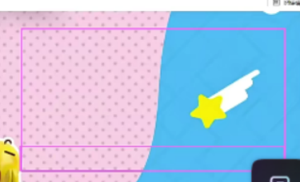
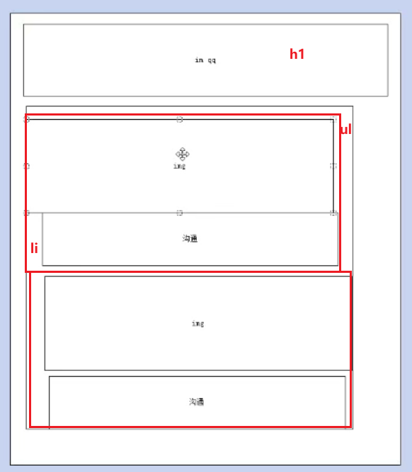

# ImQQ 页面搭建

## 首屏模块

首屏是随着浏览器的变化而变化的

首屏和我们的页面浏览器一样大，之后放一张背景图片即可。

我们的banner盒子如何让 它和浏览器一样大：

```css
body, 
html {
    width: 100%;
    height: 100%;
}
.banner {
    width: 100%;
    height: 100%;
    background-color: pink;
}

```

里面要放3个大图片：

都是绝对定位 ，只有top不一样


渐变的底



基本结构

```html
 <!-- 首屏模块 -->
    <div class="banner">
        ...
        <!-- 渐变的底部 -->
        <div class="boxshadow"></div>
    </div>
```

css部分

```css
.boxshadow {
    position: absolute;
    left: 0;
    bottom: 0;
    width: 100%;
    height: 52px;
    /* x 方向平铺重复 */
    background: url(../images/linearbot.png) repeat-x;
}
```


## 导航栏模块

不在首屏里面，而是单独的一个盒子， 采取的是绝对定位

里面有版心 960px  和  75px 的高度。


## 内容区域



```html
 <!-- 3. 真正的内容区域 -->
<div class="content">
    <h1>
        
    </h1>
    <ul>
        <!-- 第一张图片 -->
        <li>
            图片
            沟通
        </li>
        <!-- 第二张图 -->
        <li>
            图片
            沟通
        </li>
    </ul>
</div>
```


