用Flex布局模型快速开发网页
# 主体布局

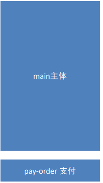

# 支付模块

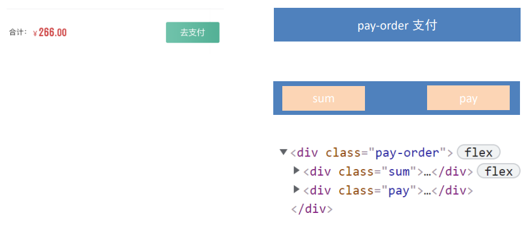

底部模块实际要高一点，避免挡住主体，通常是在主体内部加一个很高的padding-bottom

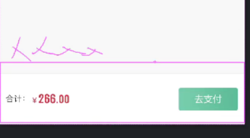

# 用户信息模块

# 商品信息模块

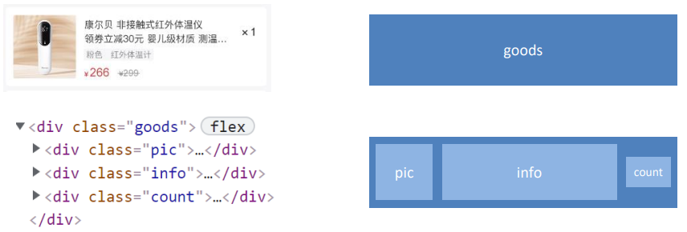

用标题标签写或者div写也可以

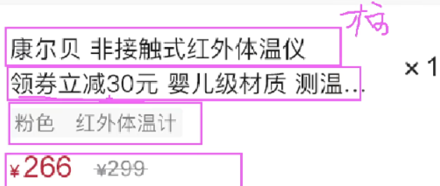

# 配送模块

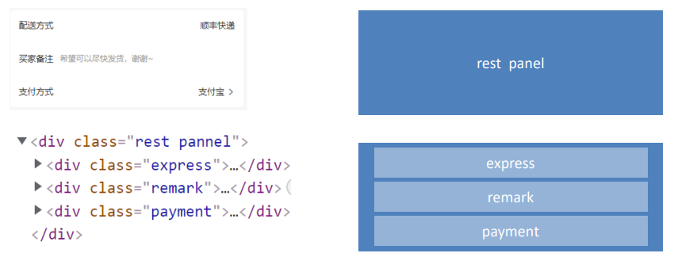

# 商品总结模块

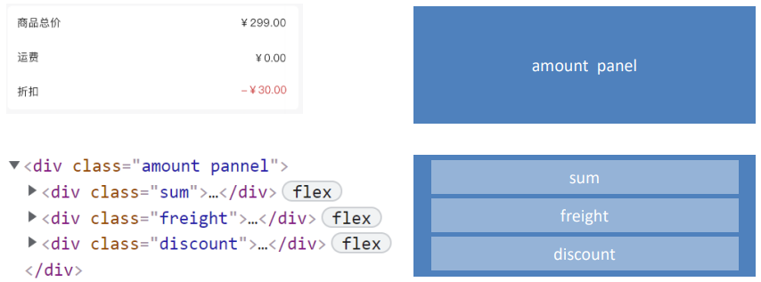

# 个人中心模块

# 整体结构布局

# 侧边栏布局

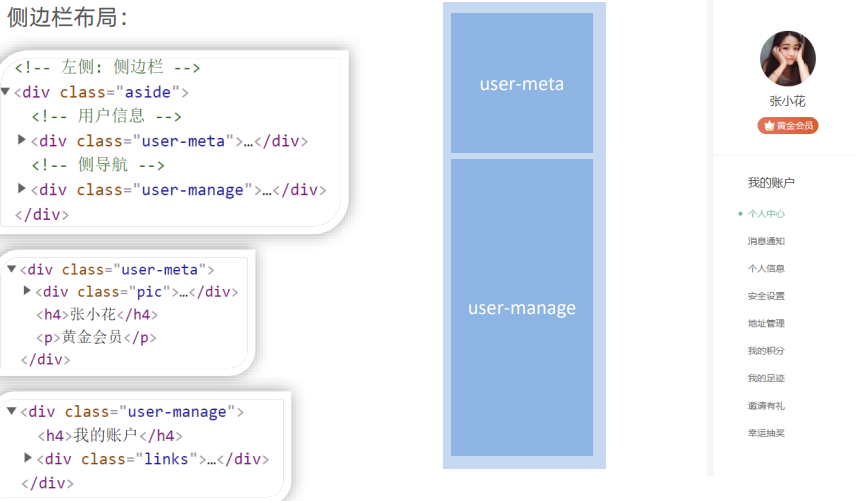

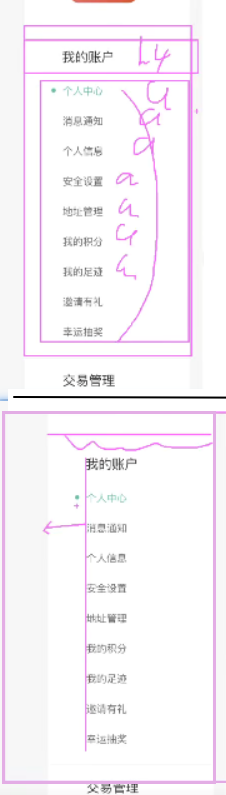

前面的小点用伪元素和display：none、绝对定位来做

# 右边主体布局

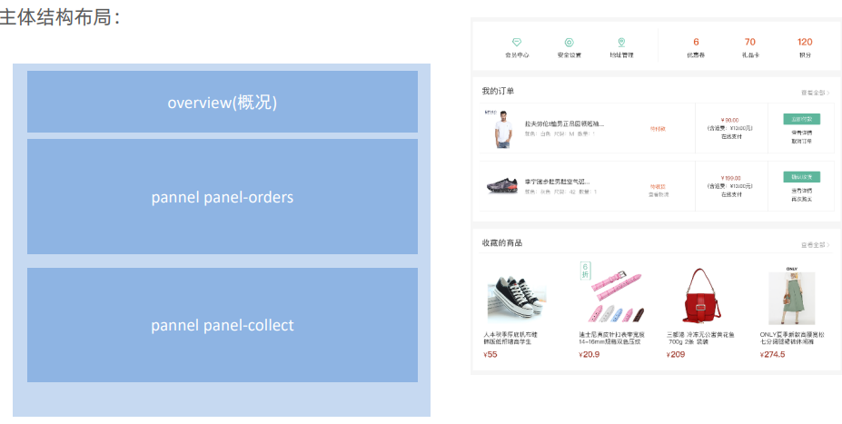

# 概况模块结构布局

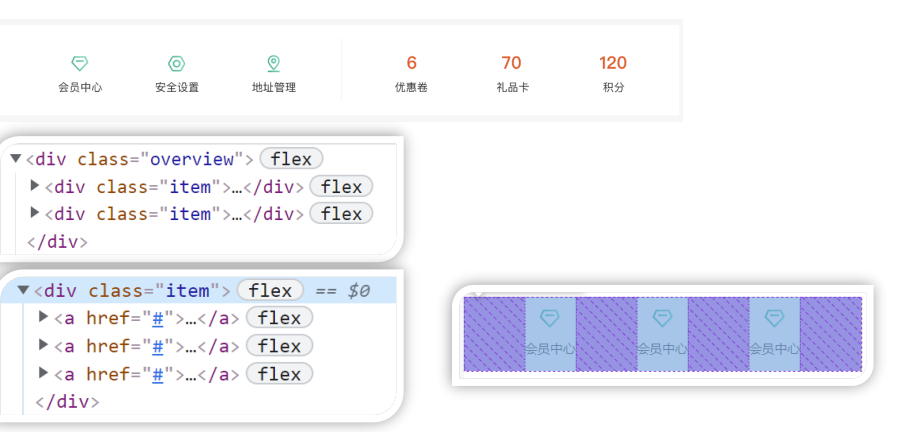

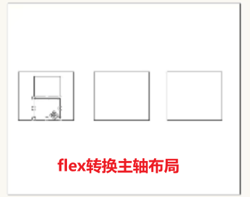

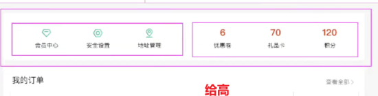

# 我的订单布局

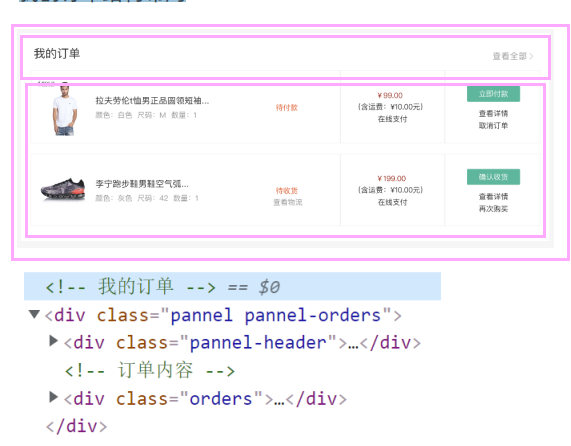

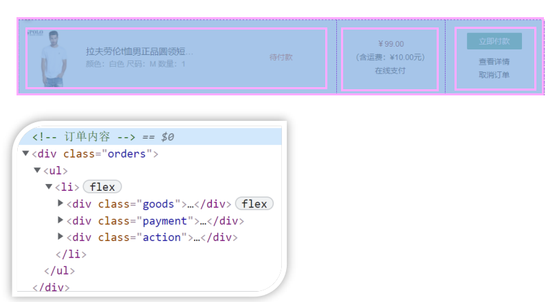

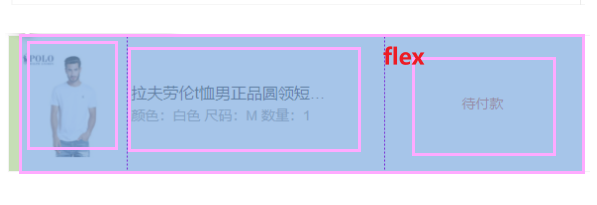

# 我的收藏布局

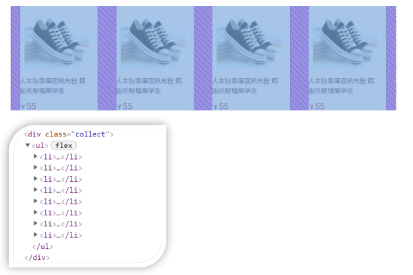