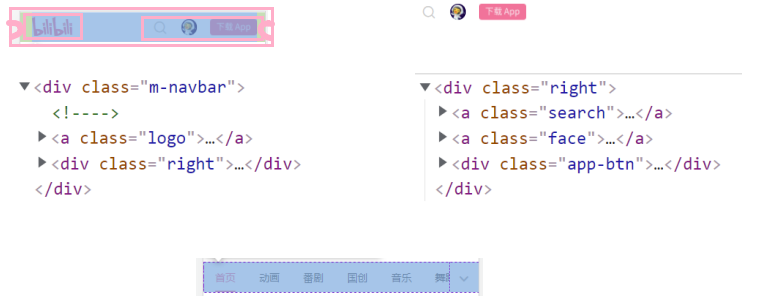
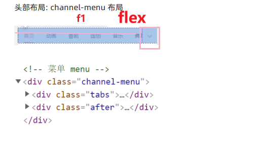
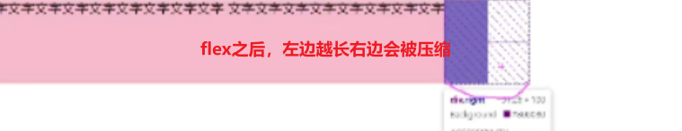
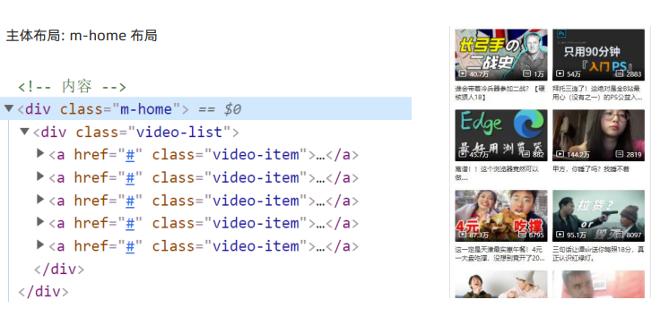
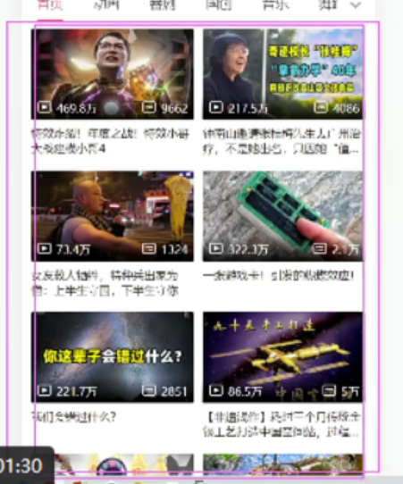
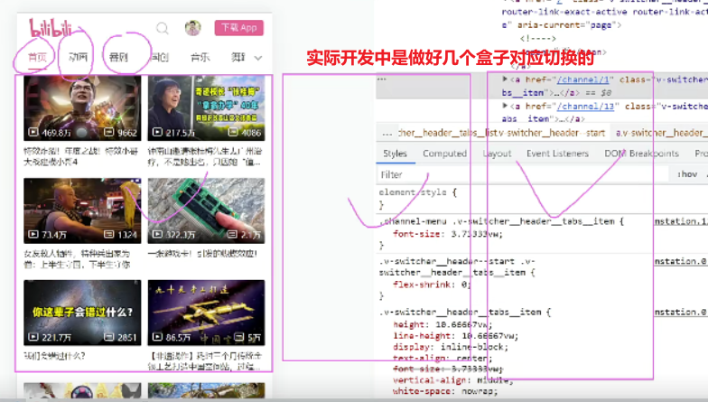
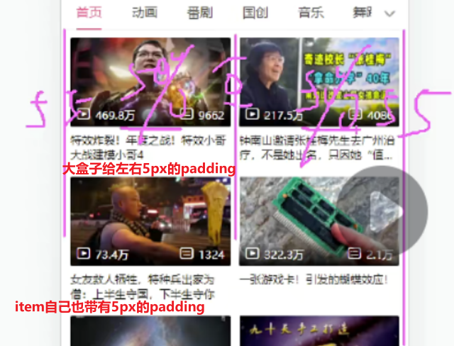
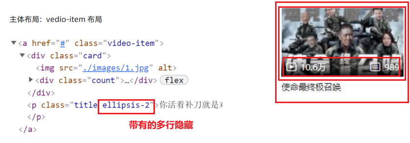
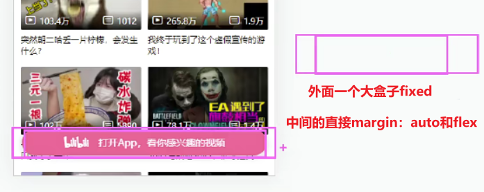
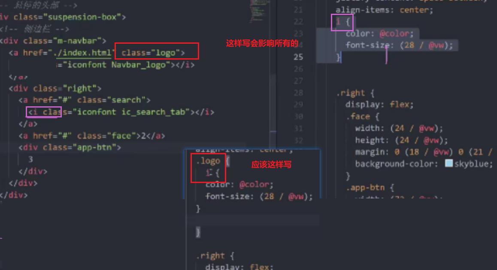

# 头部布局


## m-navbar 布局



## channel-menu 布局





注意下面粉色的细边框,不能用伪元素,因为要滑动效果

滑动效果的一般写法:

```less
.line{
  position: absolute;
  left: 0;
  bottom: 0;
  width: (28/@vw);
  height: (2/@vw);
  background-color: @color;
  transform: translateX((16/@vw));
}
```

# 主体布局

## m-home 布局






给margin会掉下来,所以给padding,如下图:








注意:做完之后发发现顶部会被覆盖,因为固定定位不占位置,给它加上 `z-index: 999;`

# 下载app布局




写代码时需要注意的

