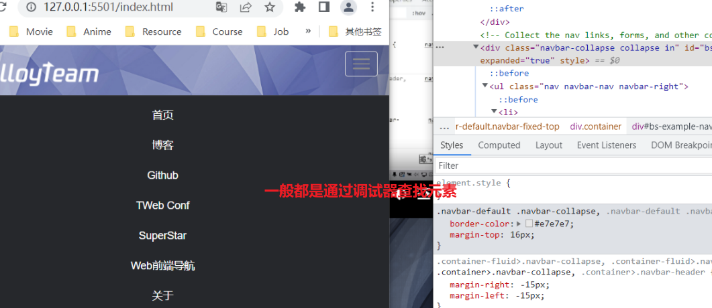
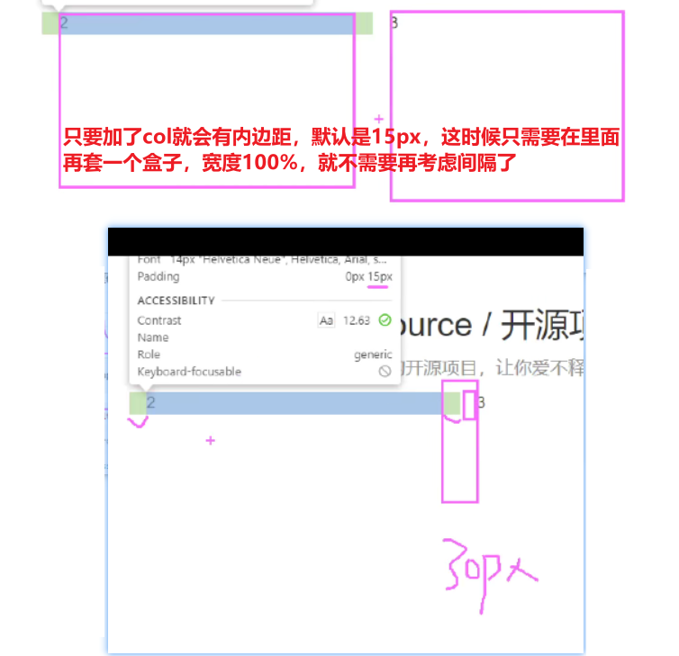
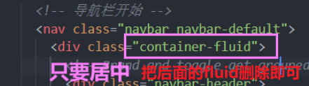
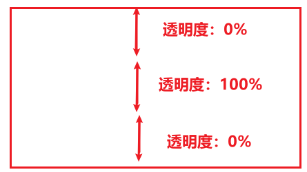

# BootStrap布局









# 亮光一闪而过的效果

          
使用伪元素，一开始是`left: -110%;`，鼠标经过之后`left: 110%;`


想要鼠标移出之后没有倒回去的效果，则把过渡加在hover
```css
.box:hover {
  transform: skew(0deg);
  transition: all .3s;
}
```

亮光的做法，一个伪元素（盒子），用白色：



```css
background-image: linear-gradient(90deg, rgba(255, 255, 255, 0), rgba(255, 255, 255, 0.5), rgba(255, 255, 255, 0));
```


技术点
- 组件
- 插件
- 栅格系统
- 定制