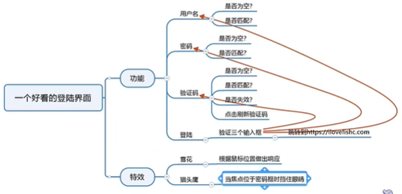

# 流程图\思维导图

# 流程图

流程图是一种用于表示算法或代码流程的框图组合，它以不同类型的框框代表不同种类的程序步骤，每两个步骤之间以箭头连接起来

代码的指导文档

有助于规划高效率的程序结构

便于与他人交流

## 流程图常见符号


## 实例

```python
name = input("你的名字:")
print("你好，"+ name +"!")
```


```python
""" 用Python设计第一个游戏 """

temp = input("不妨猜一下小甲鱼现在心里想的是哪个数字: ")
guess = int(temp)
if guess == 8:
		print("你是小甲鱼心里的蛔虫嘛? !")
		print("哼，猜中了也没奖励!")
else:
		print("猜错啦，小甲鱼现在心里想的是8!")
		print("游戏结束，不玩啦^_^")
```


```python
i = 1
sum = 0
while i<= 100:
		sum = sum + i
		i=i+1
print(sum)
```


```python
def temp conversion(c):
		f= c * 1.8 + 32
		return f
c = float(input("请输入摄氏度:"))
f= temp conversion(c)
print("转换成华氏度是:" + str(f))
```


# 思维导图

思维导图又叫心智图，是表达发散性思维的有效的图形思维工具，它简单却又极其有效，是一种革命性的思维工具


