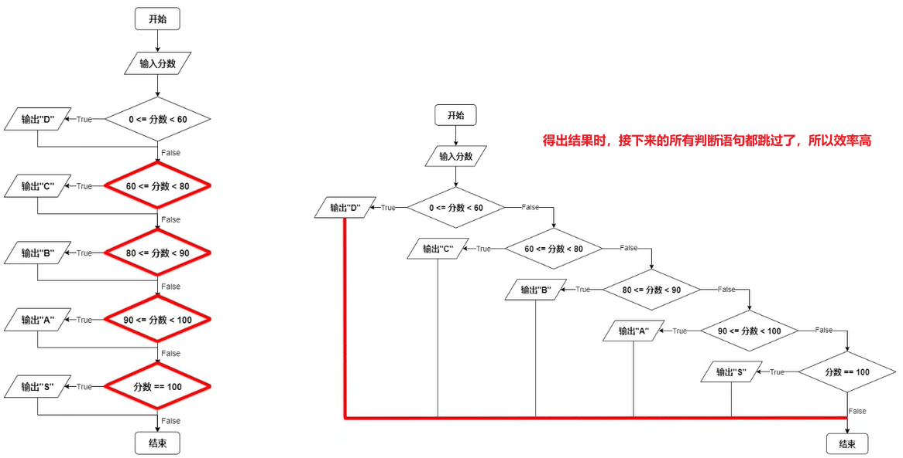
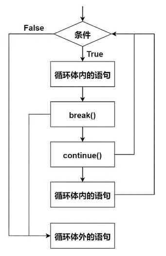

# 分支和循环

<blockquote style="background-color: #fdebec; color:red;">缩进决定从属关系</blockquote>


# 分支结构

## if

大致有五种结构

### 1、判断一个条件，如果这个条件成立，就执行其包含的某条语句或某个代码块

**语法结构**

```python
if condition:
	statement(s)
```

示例

```python
if 3 > 5:
    print("我在里面")
    print("我也在里面~")
print("我在外面~")
```

### 2、判断一个条件：如果条件成立，就执行其包含的某条语句或某个代码块；如果条件不成立，就执行另外的某条语句或某个代码块

**语法结构**

```python
if condition:
	statement(s)
else:
	statement(s)
```

示例

```python
if "FishC" =="miss":
    print("she is a girl")
else:
    print("he is not a girl")
```

### 3、判断多个条件，如果第1个条件不成立，则继续判断第2个条件，如果第2个条件还不成立，则接着判断第3个条件..…

**语法结构**

```python
if condition1:
	statement(s)
elif comdition2:
	statement(s)
elif condition3:
	statement(s)
...
```

示例

```python
score = input("请输入你的分数：")
score = int(score)

if 0 <= score < 60:
    print("D")
elif 60 <= score < 80:
    print("C")
elif 80 <= score < 90:
    print("B")
elif 90 <= score < 100:
    print("A")
elif score == 100:
    print("S")
```

单纯使用全if和使用elif的区别：elif效率更快



### 4、在第3种的情况下添加一个else，表示上面所有的条件均不成立的情况下，执行某条语句或某个代码块

**语法结构**

```python
if condition1:
	statement(s)
elif comdition2:
	statement(s)
elif condition3:
	statement(s)
...
else:
	statement(s)
```

示例

```python
score = input("请输入你的分数：")
score = int(score)

if 0 <= score < 60:
    print("D")
elif 60 <= score < 80:
    print("C")
elif 80 <= score < 90:
    print("B")
elif 90 <= score < 100:
    print("A")
elif score == 100:
    print("S")
else:
    print("请输入0~100之间的分值！") # 表示用户输入错误
```

### 5、条件表达式，将完整的if…else语句整合为一个表达式来使用

**语法结构**

```python
条件成立时执行的语句 if condition else 条件不成立时执行的语句
```

```python
age = 16
if age < 18:
    print("抱歉，未满18岁禁止访问。")
else:
    print("欢迎您来^o^")

抱歉，未满18岁禁止访问。

# ---------------------------------------

print("抱歉，未满18岁禁止访问。") if age < 18 else print("欢迎您来^o^")
抱歉，未满18岁禁止访问。
```

```python
b = 5
if a < b:
    small = a
else:
    small = b

# --------------------------------------
    
small = a if a < b else b
print(small)
3
```

<blockquote style="background-color: #fdebec; ">if…else语句变为表达式之后，很容易将其打入到一个语句的内部</blockquote>


```python
score = 66
level = ('D' if 0 <= score < 60 else
         'C' if 60 <= score < 80 else
         'B' if 80 <= score < 90 else
         'A' if 90 <= score < 100 else
         'S' if score == 100 else
         "请输入0~100之间的分值^o^")
print(level)
C
```

> 小括号用来表示是一句语句，还有之前的“\”也是


> 判断使用条件表达式还是完整的if…else语法结构，取决于项目的复杂度


一般较为复杂的选择完整的if…else结构

## 分支结构的嵌套

```python
age = 18
isMale = True
if age < 18:
    print("抱歉，未满18岁禁止访问。")
else:
    if isMale:
        print("任君选购！")
    else:
        print("抱歉，本店商品可能不适合小公举哦~")

        
任君选购！
```

<blockquote style="background-color: #fdebec; ">python只要不嫌弃就可以无限嵌套下去，但是要注意代码颜值
</blockquote> 

# 循环结构

## while

**语法结构**

```python
while condition:
	statement(s)
```

```python
love = "yes"
while love == "yes":
    love = input("今天你还爱我吗？")

    
今天你还爱我吗？yes
今天你还爱我吗？yes
今天你还爱我吗？yse

# -------------------------------------------

i = 1
sum=0
while i<= 1000000:
    sum += i
    i += 1

print(sum)
500000500000
```

死循环，不一定都是坏的，可以被设计和操控

```python
while True:
    print("作为一段没有灵魂的代码，我的任务是不断地干活！")
```

### break

```python
while True:
    answer = input("主任，我可以退出循环了？")
    if answer == "可以！":
        break

    
主任，我可以退出循环了？走着！
主任，我可以退出循环了？继续！
主任，我可以退出循环了？坚持！
主任，我可以退出循环了？可以！

```

alt+P退回上一个语句

> break语句退出循环，且后面的语句不会被执行
> 

```python
while True:
    answer = input("主任，我可以退出循环了？")
    if answer == "可以！":
        break
    print("哎，好累~~~")

    
主任，我可以退出循环了？不行！
哎，好累~~~
主任，我可以退出循环了？努力！
哎，好累~~~
主任，我可以退出循环了？闭嘴！
哎，好累~~~
主任，我可以退出循环了？可以！
```

### continue

> 退出本轮循环，接着返回到循环体的条件判断位置，然后进行下一轮的循环
> 

```python
i = 0
while i < 10:
    i += 1
    if i % 2 == 0:
        continue
    print(i)

    
1
3
5
7
9
```

### break和continue的区别



### else

> 循环条件<b style="color:red;">不再</b>为真的时候，执行else里面的语句


```python
i = 1
while i < 5:
    print("循环内，i的值是",i)
    i += 1
else:
    print("循环外，i的值是",i)

    
循环内，i的值是 1
循环内，i的值是 2
循环内，i的值是 3
循环内，i的值是 4
循环外，i的值是 5

# 乍一看好像下面这个没有什么区别

i = 1
while i < 5:
    print("循环内，i的值是",i)
    i += 1
print("循环外，i的值是",i)

循环内，i的值是 1
循环内，i的值是 2
循环内，i的值是 3
循环内，i的值是 4
循环外，i的值是 5
```

<blockquote style="color:red;">其实区别可大了，在break语句中尤为明显，break跳出循环，但是循环条件依然为真，<b>所以用break语句跳出循环，else语句并不会被执行</b>
</blockquote> 

```python
i = 1
while i < 5:
    print("循环内，i的值是",i)
    if i == 2:
        break
    i += 1
else:
    print("循环外，i的值是",i)

循环内，i的值是 1
循环内，i的值是 2
```

<blockquote style="background-color: #fdebec; ">这样的设计实际上的作用</br>
非常容易地检测到循环的退出状况，不使用标志位的情况下也可以测出
</blockquote> 

```python
day = 1
while day <= 7:
    answer = input("今天有好好学习吗？")
    if answer != "有":
        break
    day += 1
else:
    print("非常棒，你已经坚持了7天还继续学习！")

今天有好好学习吗？有
今天有好好学习吗？有
今天有好好学习吗？有
今天有好好学习吗？有
今天有好好学习吗？有
今天有好好学习吗？有
今天有好好学习吗？有
非常棒，你已经坚持了7天还继续学习！

今天有好好学习吗？有
今天有好好学习吗？有
今天有好好学习吗？有
今天有好好学习吗？有吗
```

### 循环结构的嵌套

<blockquote style="background-color: #fdebec; ">无论是break语句还是continue语句，它们只能作用于<b style="color: red;">一层</b>循环体
</blockquote> 

打印九九乘法表

```python
i = 1
while i <= 9:
    j = 1
    while j <= i:
        print(j, "*", i, "=", j * i, end=" ")
        j += 1
    print()
    i += 1

1 * 1 = 1 
1 * 2 = 2 2 * 2 = 4 
1 * 3 = 3 2 * 3 = 6 3 * 3 = 9 
1 * 4 = 4 2 * 4 = 8 3 * 4 = 12 4 * 4 = 16 
1 * 5 = 5 2 * 5 = 10 3 * 5 = 15 4 * 5 = 20 5 * 5 = 25 
1 * 6 = 6 2 * 6 = 12 3 * 6 = 18 4 * 6 = 24 5 * 6 = 30 6 * 6 = 36 
1 * 7 = 7 2 * 7 = 14 3 * 7 = 21 4 * 7 = 28 5 * 7 = 35 6 * 7 = 42 7 * 7 = 49 
1 * 8 = 8 2 * 8 = 16 3 * 8 = 24 4 * 8 = 32 5 * 8 = 40 6 * 8 = 48 7 * 8 = 56 8 * 8 = 64 
1 * 9 = 9 2 * 9 = 18 3 * 9 = 27 4 * 9 = 36 5 * 9 = 45 6 * 9 = 54 7 * 9 = 63 8 * 9 = 72 9 * 9 = 81
```

```python
day = 1
hour = 1
while day <= 7:
    while hour <= 8:
        print("今天，我一定坚持学习8小时！")
        hour += 1
        if hour > 1:
            break
    day += 1

今天，我一定坚持学习8小时！
今天，我一定坚持学习8小时！
今天，我一定坚持学习8小时！
今天，我一定坚持学习8小时！
今天，我一定坚持学习8小时！
今天，我一定坚持学习8小时！
今天，我一定坚持学习8小时！
```

## for

**语法结构**

```python
for 变量 in 可迭代对象:
		statement(s)
```

> 可迭代对象：指那些元素能够被单独提取出来的对象
> 
> 比如“lizeyan”，里面的每个字母都可以单独提取出来
> 

从字符串FishC里面取出一个字符，并赋值给变量each，循环体内只有一个语句

```python
for each in "FishC":
    print(each)

    
F
i
s
h
C

# ----------------------效果和下面的相等

i = 0
while i < len("FishC"):
    print("FishC"[i])
    i += 1

    
F
i
s
h
C

```

想要统计1到xx的总和

```python
这样写是错误的
sum = 0
for i in 1000000:
    sum += 1

    
Traceback (most recent call last):
  File "<pyshell#43>", line 1, in <module>
    for i in 1000000:
TypeError: 'int' object is not iterable
```

这是需要使用<span style="color:red;">**range，三种用法，参数只能是整数：**</span>

```python
range(stop)  # 从0开始到stop的整数数列
range(start, stop) # 指定开始和结束的位置
range(start, stop, step) # 还支持步数的跨度，步数还可以是负数
```

```python
for i in range(10):
    print(i)

    
0
1
2
3
4
5
6
7
8
9

# -----------------------

for i in range(11):
    print(i)

    
0
1
2
3
4
5
6
7
8
9
10
```

```python
for i in range(5, 10):
    print(i)

    
5
6
7
8
9
```

```python
for i in range(5, 10, 2):
    print(i)

    
5
7
9

# ---------------------------

for i in range(10,5,-2):
    print(i)

    
10
8
6
```

```python
sum = 0
for i in range(10000001):
    sum += i

print(sum)
500000500000
```

for循环也是支持嵌套，还可以搭配break，continue

```python
for n in range(2,10):
    for x in range(2,n):
        if n % x == 0:
            print(n,"=",x,"*",n//x)
            break
    else:    # 这里就肯定是一个素数，是因为可以被整除就会跳出循环，不执行else里面的语句
        print(n,"是一个素数") # 只有一种情况被执行，内层循环跑了一遍都没有可以被整除的

        
2 是一个素数
3 是一个素数
4 = 2 * 2
5 是一个素数
6 = 2 * 3
7 是一个素数
8 = 2 * 4
9 = 3 * 3
```