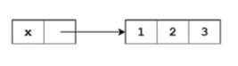
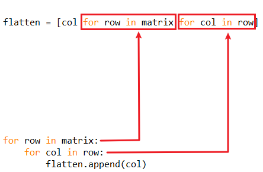

# 列表

# 创建列表

```python
# 创建匿名的列表
[1,2,3,4,5]
[1, 2, 3, 4, 5]
```

<blockquote style="background-color: #fdebec; color:red;">列表可以容纳不同类型的数据</blockquote> 

创建匿名的列表，匿名列表之后再也无法使用或者访问

```python
[1,2,3,4,5,"上山打老虎"]

[1, 2, 3, 4, 5, '上山打老虎']
```

序列是pyhon最常见的数据结构，字符串、列表都是序列

按顺序访问列表上的每一个元素

```python
rhyme = [1,2,3,4,5,"上山打老虎"]
for each in rhyme:
    print(each)

    
1
2
3
4
5
上山打老虎
```

单独访问列表中的某一个元素，使用下标索引的方式

```python
rhyme[0]
1

rhyme[1]
2

rhyme[5]
'上山打老虎'

length = len(rhyme)
rhyme[length -1 ]
'上山打老虎'

rhyme[-1 ]
'上山打老虎'
```


# 列表切片

因为这个python才从0开始的

## 常规切片

```python
rhyme[0:3]
[1, 2, 3]

rhyme[3:6]
[4, 5, '上山打老虎']
```

## 省略首尾

```python
rhyme[:3]
[1, 2, 3]

rhyme[3:]
[4, 5, '上山打老虎']

rhyme[:]
[1, 2, 3, 4, 5, '上山打老虎']
```

## 设置跨步

```python
rhyme[0:6:2]
[1, 3, 5]

rhyme[::2]
[1, 3, 5]

# ------------------
# 倒序输出

rhyme[::-2]
['上山打老虎', 4, 2]

rhyme[::-1]
['上山打老虎', 5, 4, 3, 2, 1]
```

# 列表的诸多方法

## 增

### append()

在列表末尾添加指定的元素，但是只能添加<span style="color:red;">**单个**</span>

```python
heros =["钢铁侠","绿巨人"]
heros.append("黑寡妇")

heros
['钢铁侠', '绿巨人', '黑寡妇']
```

### extend()

允许添加一个可迭代对象

<blockquote style="background-color: #fdebec; ">extend()方法的参数<b style="color:red;">必须是一个可迭代对象</b>，新的内容是追加到原列表最后一个元素的后面
</blockquote> 

```python
heros.extend(["鹰眼","灭霸","雷神"])

heros
['钢铁侠', '绿巨人', '黑寡妇', '鹰眼', '灭霸', '雷神']
```

使用切片也可以实现类似的效果

```python
s=[1,2,3,4,5]

s[len(s):]=[6]
s
[1, 2, 3, 4, 5, 6]

# --------------------

s[len(s):]=[7,8,9]
s
[1, 2, 3, 4, 5, 6, 7, 8, 9]
```

### insert()

在列表的任意位置添加数据，两个参数，一个插入的位置，一个插入的元素

```python
s=[1,3,4,5]

s.insert(1,2)
s
[1, 2, 3, 4, 5]

s.insert(0,0)
s
[0, 1, 2, 3, 4, 5]

s.insert(len(s),6)
s
[0, 1, 2, 3, 4, 5, 6]
```

## 删

### remove()

删除指定的元素

<blockquote style="background-color: #fdebec; ">如果列表中存在多个匹配的元素，<span style="color:red;">那么它只会删除第一个</span></br>
如果指定的元素<span style="color:red;">不存在</span>，那么程序就会<span style="color:red;">报错</span>
</blockquote> 

```python
heros.remove("灭霸")
heros
['钢铁侠', '绿巨人', '黑寡妇', '鹰眼', '雷神']

heros.remove("金莲")
Traceback (most recent call last):
  File "<pyshell#61>", line 1, in <module>
    heros.remove("金莲")
ValueError: list.remove(x): x not in list
```

### pop()

删除某个位置上的元素

```python
heros.pop(2)
'黑寡妇'
 
heros
['钢铁侠', '绿巨人', '鹰眼', '雷神']
```

### clear()

清空列表

```python
heros.clear()
heros
[]
```

## 改

替换列表的元素和访问列表的元素一样，都是使用下标索引的方法，用赋值运算符就可以将新值替换进去了

```python
heros = ["蜘蛛侠","绿巨人","黑寡妇","鹰眼","灭霸","雷神"]
heros[4] = "钢铁侠"
heros
['蜘蛛侠', '绿巨人', '黑寡妇', '鹰眼', '钢铁侠', '雷神']
```

连续替换

```python
heros[3:]=["武松","林冲","李逵"]
heros
['蜘蛛侠', '绿巨人', '黑寡妇', '武松', '林冲', '李逵']
```

> 其实它是分两个步骤来实现的
>
>Step one: 将赋值号(=)左边指定的内容删除
>
>Step two: 将包含在赋值号(=)右边的可迭代对象中的片段插入左边被删除的位置

### sort()

顺序排序，从小到大排序

```python
nums = [3,1,9,6,8,3,5,3]
nums.sort()
nums
[1, 3, 3, 3, 5, 6, 8, 9]
```

该函数有两个参数，第一个是自定义排序的算法，第二个是reverse，默认是False，如果是True则如下

```python
nums = [3,1,9,6,8,3,5,3]
nums.sort(reverse=True)
nums
[9, 8, 6, 5, 3, 3, 3, 1]

# 效果和先执行sort再执行reverse一样
```

### reverse()

反序排序，但是不会按照大小排，只是把顺序反过来

```python
nums.sort()
nums
[1, 3, 3, 3, 5, 6, 8, 9]

nums.reverse()
nums
[9, 8, 6, 5, 3, 3, 3, 1]

nums = [3,1,9,6,8,3,5,3]
nums.reverse()
nums
[3, 5, 3, 8, 6, 9, 1, 3]

heros
['蜘蛛侠', '绿巨人', '黑寡妇', '武松', '林冲', '李逵']
heros.reverse()
heros
['李逵', '林冲', '武松', '黑寡妇', '绿巨人', '蜘蛛侠']
```

## 查

### count()

查找某个元素出现的次数

```python
nums.count(3)
3
```

### index()

参数

```python
# 指定查找的开始和结束的位置
index(x, start, end)
```

查找某个元素的索引值，有多个元素时，只返回第一个元素的下标

```python
heros.index("绿巨人")
4

nums = [3,1,9,6,8,3,5,3]
nums.index(3)
0

nums.index(3,1,7)
5
```

不知道索引值但是想修改某个元素时

```python
heros[heros.index("绿巨人")]="神奇女侠"
heros
['李逵', '林冲', '武松', '黑寡妇', '神奇女侠', '蜘蛛侠']
```

### copy()

拷贝一个列表

```python
nums_copy1 = nums.copy()
nums_copy1
[3, 1, 9, 6, 8, 3, 5, 3]
```

也可使用切片来实现

```python
nums_copy2 = nums[:]
nums_copy2
[3, 1, 9, 6, 8, 3, 5, 3]
```

这两个都是浅拷贝  shallow copy

嵌套列表就是多维列表

# 列表的加法和乘法

## 加法

其实就是拼接，“+”两边应该都是列表

```python
s = [1,2,3]
t = [4,5,6]
s + t
[1, 2, 3, 4, 5, 6]
```

## 乘法

重复列表内的所有元素若干次

```python
s * 3
[1, 2, 3, 1, 2, 3, 1, 2, 3]
```

# 嵌套列表

## 创建嵌套列表

```python
matrix = [[1,2,3],[4,5,6],[7,8,9]]

martix = [[1,2,3],
          [4,5,6],
          [7,8,9]]

# 不管怎么写，在内存中事实上都是横向存放的

martix
[[1, 2, 3], [4, 5, 6], [7, 8, 9]]
```

二维列表常常的应用方面是举证，martix就是举证的意思

## 访问嵌套列表

```python
for i in martix:
    for each in i:
        print(each)

        
1
2
3
4
5
6
7
8
9

for i in martix:
    for each in i:
        print(each, end=' ')
    print()

    
1 2 3 
4 5 6 
7 8 9 

martix[0]
[1, 2, 3]

martix[0][0]
1

martix[1][1]
5

martix[2][2]
9
```

创建二维列表并同时初始化

```python
A = [0]*3
A
[0, 0, 0]
for i in range(3):
    A[i] = [0] * 3

    
A
[[0, 0, 0], [0, 0, 0], [0, 0, 0]]
```

下面这种写法是高级错误

```python
B = [[0] * 3] * 3
B
[[0, 0, 0], [0, 0, 0], [0, 0, 0]]
```

比较一下就知道问题在哪里

```python
A[1][1] =1
A
[[0, 0, 0], [0, 1, 0], [0, 0, 0]]

B[1][1] = 1
B
[[0, 1, 0], [0, 1, 0], [0, 1, 0]]
```

is——同一性运算符，用来检验两个变量是否指向同一个对象的一个运算符

注意看下面的两种不同数据类型比较的结果

```python
x= "FishC"
y= "FishC"
x is y
True

x = [1,2,3]
y = [1,2,3]
x is y
False
```

<blockquote style="background-color: #fdebec; ">Python对于不同对象的存储机制是不一样的
</blockquote> 

由于字符串是不可变的，只需要在内存中开辟一个位置存储即可，如果有多个变量指向同一字符串，则关系如下


相比字符串，则列表是可变的，Python无法预测用户什么时候往列表里面添加元素，所以尽管两个列表的内容一样，Python还是为其开辟了两个不同的位置来进行存放


再来比较一下A、B

```python
A[0] is A[1]
False
A[1] is A[2]
False

B[0] is B[1]
True
B[1] is B[2]
True
```

> B的问题在于试图同通过乘号对一个列表进行拷贝，但是其实拷贝的是对同一列表的引用，不是拷贝，只是重复去引用它，不是真正物理意义上的拷贝


其关系大概如下：


# 浅拷贝与深拷贝

## 知识点补充

```python
x = [1,2,3]
y = x
x[1] = 1

x
[1, 1, 3]
y
[1, 1, 3]
```

当赋值运算发生的时候，Python不是将数据放到变量里面，而是将<span style="color:red;">**变量与数据进行挂钩，称之为引用**</span>



将一个变量赋值给另一个变量，其实就是<span style="color:red;">**将一个变量的引用传递给另一个变量**</span>


通过变量y来访问内容也会改变


想要得到两个独立的列表，需要用到拷贝来完成任务

## 浅拷贝

处理一维列表一般没有问题

### copy()

拷贝的是整个列表对象，不仅仅是变量的引用

```python
x = [1,2,3]
y = x.copy()
x[1]=1

x
[1, 1, 3]
y
[1, 2, 3]
```

这样y里面的值不会受到改变的影响


### 切片

```python
x = [1,2,3]
y = x[:]
x[1] = 1

x
[1, 1, 3]
y
[1, 2, 3]
```

对于二维列表的拷贝就不太行了

```python
x = [[1,2,3],[4,5,6],[7,8,9]]
y = x.copy()
x[1][1] = 0

x
[[1, 2, 3], [4, 0, 6], [7, 8, 9]]
y
[[1, 2, 3], [4, 0, 6], [7, 8, 9]]
```

浅拷贝至拷贝了外层的对象，嵌套对象只拷贝了其引用


## 深拷贝

多层嵌套，深拷贝都会全部拷贝进去

默认为浅拷贝是因为效率问题

### 借助copy模块

> 使用模块前要引入
> 

该模块有两个函数，一个是**copy**实现浅拷贝

```python
import copy
x = [[1,2,3],[4,5,6],[7,8,9]]
y = copy.copy(x)
x[1][1] = 0

x
[[1, 2, 3], [4, 0, 6], [7, 8, 9]]
y
[[1, 2, 3], [4, 0, 6], [7, 8, 9]]
```

> `x.copy()`：列表的一个copy方法
>
> `copy.copy(x)`：copy模块的一个copy函数
> 

**deepcopy**实现的是深拷贝

```python
x = [[1,2,3],[4,5,6],[7,8,9]]
y = copy.deepcopy(x)
x[1][1] = 0

x
[[1, 2, 3], [4, 0, 6], [7, 8, 9]]
y
[[1, 2, 3], [4, 5, 6], [7, 8, 9]]
```


# 列表推导式

简单例子

```python
oho = [1, 2, 3, 4, 5]
for i in range(len(oho)):
    oho[i] = oho[i] * 2

    
oho
[2, 4, 6, 8, 10]

oho = [1, 2, 3, 4, 5]
oho = [i * 2 for i in oho]

oho
[2, 4, 6, 8, 10]
```

<blockquote style="background-color: #fdebec; ">从程序执行的效率来说，列表推导式的速率通常比循环语句要快上一倍左右的速度</blockquote> 

主要是因为列表推导式在Python解释器里面，是以更快的C语言的速度来运行的，因此比我们使用这个Python脚本的虚拟机pvm里面以步进的速度来运行for循环要快很多很多

## 构建列表推导式

```python
[expression for target in iterable]

expression: 表达式，相当于循环体
```

例子

```python
x = [ i for i in range(10)]

x
[0, 1, 2, 3, 4, 5, 6, 7, 8, 9]
```

x列表里面的数据

<blockquote style="background-color: #fdebec; ">

for语句通过迭代以此获得从0到9十个整数</br>
每一个迭代就会将数值存放到一个叫做i的变量里面</br>
但是这个i还不是最终存放到列表里面的元素</br>
<span style="color:red;">**列表最终存放的数据取决于for语句左侧的表达式**</br></span>
这里只有一个字符 i，所以存放的是i</blockquote> 

```python
x = [ i+1 for i in range(10)]

x
[1, 2, 3, 4, 5, 6, 7, 8, 9, 10]

# -----------------------------

# 转化为for表达式

x = []
for i in range(10):
    x.append(i+1)

    
x
[1, 2, 3, 4, 5, 6, 7, 8, 9, 10]
```

处理字符串也可以

```python
y = [c * 2 for c in "FishC"]

y
['FF', 'ii', 'ss', 'hh', 'CC']
```

把相应的字符转化为对应的Unicode编码

```python
code = [ord(c) for c in "FishC"]
code
[70, 105, 115, 104, 67]
```

二维列表中的应用

```python
# 获取第二列的元素
martix = [[1,2,3],
          [4,5,6],
          [7,8,9]]
col2 = [row[1] for row in martix]

col2
[2, 5, 8]

# 获取对角线，不是从for语句中获取内容，拿到的是对应的索引值
diag = [martix[i][i] for i in range(len(martix))]
diag
[1, 5, 9]
```

创建列表也可以

```python
s = [[0] * 3 for i in range(3)]

s
[[0, 0, 0], [0, 0, 0], [0, 0, 0]]

s[1][1] = 1

s
[[0, 0, 0], [0, 1, 0], [0, 0, 0]]
```

## 列表推导式可以添加筛选条件

```python
[expression for target in iterable if condition]
```

```python
even = [i for i in range(10) if i % 2 == 0]
even
[0, 2, 4, 6, 8]

even = [i + 1 for i in range(10) if i % 2 == 0]
even
[1, 3, 5, 7, 9]
```

执行顺序


筛选开头为F的元素

```python
words = ["Great","FishC","Brilliant","Excellent","Fanasic"]
fwords = [w for w in words if w[0] == 'F']
fwords
['FishC', 'Fanasic']
```

## 嵌套的列表推导式

```python
[expression for target in iterable1
            for target in iterable2
                       ...
            for target in iterableN]
```

嵌套的列表推导式对应嵌套的循环

一般可以使用在降维

```python
martix = [[1,2,3],[4,5,6],[7,8,9]]
flatten = [col for row in matrix for col in row]

flatten
[1, 2, 3, 4, 5, 6, 7, 8, 9]

# 转化为for循环

flatten = []
for row in matrix:
    for col in row:
        flatten.append(col)

        
flatten
[1, 2, 3, 4, 5, 6, 7, 8, 9]
```



```python
[x + y for x in "fishC" for y in "FISHC"]
['fF', 'fI', 'fS', 'fH', 'fC', 'iF', 'iI', 'iS', 'iH', 'iC', 'sF', 'sI', 'sS', 'sH', 'sC', 'hF', 'hI', 'hS', 'hH', 'hC', 'CF', 'CI', 'CS', 'CH', 'CC']

# ----------------------------------------

_ = []
for x in "fishC":
    for y in "FISHC":
        _.append(x + y)

        
_
['fF', 'fI', 'fS', 'fH', 'fC', 'iF', 'iI', 'iS', 'iH', 'iC', 'sF', 'sI', 'sS', 'sH', 'sC', 'hF', 'hI', 'hS', 'hH', 'hC', 'CF', 'CI', 'CS', 'CH', 'CC']
```

> “_”：某个变量要是临时的或者无关紧要的，可以直接使用下划线当变量名
> 

## 列表推导式的终极语法

```python
[expression for target in iterable1 if condition1
            for target in iterable2 if condition2
                       ...
            for target in iterableN if conditionN]
```

```python
[[x,y] for x in range(10) if x % 2 == 0 for y in range(10) if y % 3 == 0]
[[0, 0], [0, 3], [0, 6], [0, 9], [2, 0], [2, 3], [2, 6], [2, 9], [4, 0], [4, 3], [4, 6], [4, 9], [6, 0], [6, 3], [6, 6], [6, 9], [8, 0], [8, 3], [8, 6], [8, 9]]

# ------------------------------------------------------------------

_ = []
for x in range(10):
    if x % 2 == 0:
        for y in range(10):
            if y % 3 == 0:
                _.append([x, y])

                
_
[[0, 0], [0, 3], [0, 6], [0, 9], [2, 0], [2, 3], [2, 6], [2, 9], [4, 0], [4, 3], [4, 6], [4, 9], [6, 0], [6, 3], [6, 6], [6, 9], [8, 0], [8, 3], [8, 6], [8, 9]]
```

编写代码要注意kiss原则：Keep It Simple & Stupid

序列：字符串、列表、元组