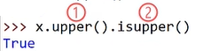
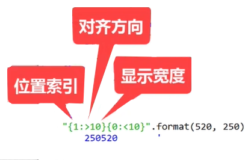

# 字符串

类似元组一样不可变的序列

使用切片的方式进行反转

```python
x = "12321"
"是回文数" if x == x[::-1] else "不是回文数"
'是回文数'

x = "12345"
"是回文数" if x == x[::-1] else "不是回文数"
'不是回文数'
```

# 大小写字母互换方法

<blockquote style="background-color: #fdebec; ">
返回的不是原字符串，而是按照规则生成的新字符串，因为字符串不可变
</blockquote> 

## capitalize()

语句中的首字母变大写，其他字母小写

```python
x = "I love FishC"
x
'I love FishC'

x.capitalize()
'I love fishc'
```

## casefold()

返回所有字母都是小写的新字符串，<span style="color:red;">**可以处理多种语言字符**</span>

```python
x.casefold()
'i love fishc'
```

```python
'ß'.lower()
'ß'

'ß'.casefold()
'ss'
```

## title()

单词中的首字母的大写，其他字母小写

```python
x.title()
'I Love Fishc'
```

## swapcase()

将字符串中的所有字符大小写翻转

```python
x.swapcase()
'i LOVE fISHc'
```

## upper()

所有字母变成大写

```python
x.upper()
'I LOVE FISHC'
```

## lower()

所有字母变成小写，<span style="color:red;">**只能处理英文字母**</span>

```python
x.lower()
'i love fishc'
```

# 左中右对其方法

width：指定整个字符串的宽度

fillchar：指定填充的内容，默认为空格

指定的宽度≤原字符串，不用对其了，直接原串输出即可

```python
x = "有内鬼，停止交易！"
x.center(5)
'有内鬼，停止交易！'
```

## center(width, fillchar=’ ’)

```python
x.center(15)
'   有内鬼，停止交易！   '

x.center(15,"h")
'hhh有内鬼，停止交易！hhh'
```

## ljust(width, fillchar=’ ’)

```python
x.ljust(15)
'有内鬼，停止交易！      '

x.ljust(15,"h")
'有内鬼，停止交易！hhhhhh'
```

## rjust(width, fillchar=’ ’)

```python
x.rjust(15)
'      有内鬼，停止交易！'

x.rjust(15,"h")
'hhhhhh有内鬼，停止交易！'
```

## zfill(width)

用0填充左侧

```python
x.zfill(15)
'000000有内鬼，停止交易！'
```

这个用法在做数据报表的时候比较有用

```python
# 要求数据宽度是5个字符
"520".zfill(5)
'00520'

# 可以处理负数的数据情况
"-520".zfill(5)
'-0520'
```

# 查找

## count(sub[, start[, end]])

查找sub参数指定的子字符串，在字符串中出现的次数

start和end指定查找的起始和结束位置

```python
x = "上海自来水来自海上"
x.count("海")
2
x.count("海",0,5)
1
```

## find(sub[, start[, end]])

用于定位sub参数指定的子字符串在字符串中的索引下标值

从<span style="color:red;">左往右</span>找

```python
x.find("海")
1

# -------------

x.find("龟")
-1
```

## rfind(subl, startl, end]])

从<span style="color:red;">右往左</span>找

```python
x.rfind("海")
7
```

## index(sub[, start[, end]

和find方法类似，只不过是处理找不到的字符有点不同

```python
x.index("龟")
Traceback (most recent call last):
  File "<pyshell#6>", line 1, in <module>
    x.index("龟")
ValueError: substring not found
```

## rindex(sub[, start[, end]])

和rfind方法类似

# 替换

## expandtabs([tabsize=8])

使用空格来替换制表符并且返回一个新的字符串

当遇到一段混合使用空格和tab来缩进的代码，可以统一使用哪种字符表示缩进

```python
code ="""
    print("I love FishC")  # tab表示缩进
print("I love my wife") """  # 空格表示缩进

new_code=code.expandtabs(4)

print(new_code)   # 统一成4个空格

    print("I love FishC")
    print("I love my wife")
```

## replace(old, new, count=-1)

返回一个将所有old的参数指定的子字符串替换为new参数指定的新字符串

count：指定的是替换的次数，默认是-1，不指定的话就是全部替换

```python
"在吗！我在你家楼下，快点下来！！".replace("在吗","想你")
'想你！我在你家楼下，快点下来！！'
```

## translate(table)

返回根据table参数转换后的新字符串

table：表格，用于指定一个转换规则的表格

转换规则的表格如何生成获得

### str.maketrans(x[, y[, z]])

x中的字符转换为y中的字符，z表示要忽略字符

```python
table = str.maketrans("ABCDEFG","1234567")

"I love FishC".translate(table)
'I love 6ish3'

"I love FishC".translate(str.maketrans("ABCDEFG","1234567"))
'I love 6ish3'

"I love FishC".translate(str.maketrans("ABCDEFG","1234567","love"))
'I  6ish3'
```

# 判断

## startswith(prefix[, start[, end]])

判断这个参数指定的子字符串是否出现在字符串的起始位置

方括号里面的参数是可选参数

start：表示开始匹配的位置

end：表示结束匹配的位置

<blockquote style="background-color: #fdebec; ">参数支持以元组的形式传入多个待匹配的字符串
</blockquote> 

```python
x = "我爱python"

x.startswith("我")
True

x.startswith("李泽言")
False

x.startswith("我",1)
False

x.startswith("爱",1)
True

if x.startswith(("你" , "我", "她")):
    print("总有人喜欢Pyhon")

    
总有人喜欢Pyhon
```

## endswith(suffix[, start[, end]])

判断这个参数指定的子字符串是否出现在字符串的结束位置

```python
x.endswith("python")
True
x.endswith("py")
False

x.endswith("py",0,4)
True
```

## istitle()

判断字符中的所有单词字母是否都以大写开头，其他字母均是小写

```python
x = "I love Python"
x.istitle()
False
```

## isupper()

判断字符中的所有单词字母是否都是大写

```python
x.isupper()
False

x.upper().isupper()
True
```

一个语句中连续调用多个方法，python是从左往右依次调用



## islower()

判断字符中的所有单词字母是否都是小写

## isalpha()

判断一个字符串中是否只有字母构成

```python
x.isalpha()  # 空格不算字符串
False

"ILovePython".isalpha()
True
```

## isspace()

判断是否为一个空白字符串

tab、空格、“\n”等等这些都可以被认为是空白字符串

```python
"    \n".isspace()
True
```

## isprintable()

判断字符串中所有字符是否可以被打印

转义字符是不可打印 

```python
x.isprintable()
True

"I love FishC\n".isprintable()
False
```

## isdecimal()

```python
x = "12345"
x.isdecimal()
True

x = "2²"
x.isdecimal()
False

x = "ⅠⅡⅢⅣⅤ"
x.isdecimal()
False

x = "一二三四五"
x.isdecimal()
False
```

## isdigit()

```python
x = "12345"
x.isdigit()
True

x = "2²"
x.isdigit()
True

x = "ⅠⅡⅢⅣⅤ"
x.isdigit()
False

x = "一二三四五"
x.isdigit()
False
```

## isnumeric()

```python
x = "12345"
x.isnumeric()
True

x = "2²"
x.isnumeric()
True

x = "ⅠⅡⅢⅣⅤ"
x.isnumeric()
True

x = "一二三四五"
x.isnumeric()
True
```

<blockquote style="background-color: #fdebec; ">这三个函数可接受的范围尺度不一样，isnumeric最大，但也不是说越大越好，看程序的需求
</blockquote> 

## isalnum()

只要isalpha()、isdecimal()、isdigit()、isnumeric()这个只要任意返回True，它就是True

## isidentifier()

判断一个字符串是否是一个合法的Python标识符，例如检测是否是合法的变量名

```python
"I am a good gay".isidentifier()
False

"I_am_a_good_gay".isidentifier()
True

"FishC520".isidentifier()
True

"520FishC".isidentifier()
False
```

判断字符串是否为Python的保留标识符，像if，while这种

使用keyword模块的iskeyword函数

```python
import keyword
keyword.iskeyword("if")
True
keyword.iskeyword("py")
False
```

# 截取

## lstrip(chars=None)

删除字符串左侧空白

chars=None：表示去除的是空白

传入的虽然是一串字符，但是它是按照单个字符为单位进行匹配去剔除的，只要匹配中了都得踢掉

```python
"   左侧不要留白".lstrip()
'左侧不要留白'

"www.ilovefishc.com".lstrip("wcom.")
'ilovefishc.com'
```

## rstrip(chars=None)

删除字符右侧空白

```python
"右侧不要留白   ".rstrip()
'右侧不要留白'

"www.ilovefishc.com".rstrip("wcom.")
'www.ilovefish'
```

## strip(chars=None)

```python
"   左右不要留白  ".strip()
'左右不要留白'

"www.ilovefishc.com".strip("wcom.")
'ilovefish'
```

## removeprefix(prefix)

删除指定的字符串/前缀，而不是单个字符

```python
"www.ilovefishc.com".removeprefix("www.")
'ilovefishc.com'
```

## removesuffix(suffix)

删除指定的字符串/后缀，而不是单个字符

```python
"www.ilovefishc.com".removesuffix(".com")
'www.ilovefishc'
```

# 拆分

## partition(sep)

将字符串以参数指定的分割符为依据进行切割，并且将切割后的结果返回一个三元组

从左到右

```python
"www.ilovefishc.com".partition(".")
('www', '.', 'ilovefishc.com')
```

## rpartition(sep)

从右到左

```python
"www.ilovefishc.com/python".rpartition("/")
('www.ilovefishc.com', '/', 'python')
```

## split(sep=None, maxsplit=-1)

根据分割符将字符串切成一小块一小块，默认情况下切分空格

sep：指定分割符

maxsplit：指定分割次数，-1表示找到分割就切

```python
"每日新 日日新 又日新".split()
['每日新', '日日新', '又日新']

"每日新，日日新，又日新".split('，')
['每日新', '日日新', '又日新']

"每日新，日日新，又日新".split('，',1)
['每日新', '日日新，又日新']

"每日新\n日日新\n又日新".split('\n')
['每日新', '日日新', '又日新']

"每日新\r日日新\r又日新".split('\r')
['每日新', '日日新', '又日新']
```

## rsplit(sep=None, maxsplit=-1)

从右到左

```python
"每日新，日日新，又日新".rsplit('，')
['每日新', '日日新', '又日新']

"每日新，日日新，又日新".rsplit('，',1)
['每日新，日日新', '又日新']
```

由于操作系统换行符的指令不同，实际切割换行符有很多麻烦，可以用下面的方法

## splitlines(keepends=False)

按行进行分割，并将结果以列表的形式返回

keepends：指定结果是否要包含这个换行符，Ture包含

```python
"每日新\n日日新\n又日新".splitlines()
['每日新', '日日新', '又日新']

"每日新\n日日新\r又日新".splitlines()
['每日新', '日日新', '又日新']

"每日新\n日日新\r\n又日新".splitlines()
['每日新', '日日新', '又日新']

"每日新\n日日新\r\n又日新".splitlines(True)
['每日新\n', '日日新\r\n', '又日新']
```

# 拼接

## join(iterable)

拼接速率非常高，远高于加号

“”前面这个做为分割符的形式，而构成字符串的每一个子字符串放在join方法的参数里边，可以是列表/元组

做大数据的用join

```python
".".join(["www","ilovefishc","com"])
'www.ilovefishc.com'

"^".join(("F","ish","C"))
'F^ish^C'

s = "FishC"
s += s
s
'FishCFishC'

"".join(("FishC","FishC"))
'FishCFishC'
```

# 格式化字符串

# format

花括号是占位的

```python
year = 2010
"鱼C工作室成立于year 年"
'鱼C工作室成立于year 年'

"鱼C工作室成立于{}年".format(year)
'鱼C工作室成立于2010年'
```

参数中的元素会被当成元组元素来对待

同一个索引值可以引用多次

```python
"1+2={}，2的平方是{}，3的立方是{}".format(1+2,2*2,3*3*3)
'1+2=3，2的平方是4，3的立方是27'

"{}看到{}就很激动！".format("小甲鱼","漂亮的小姐姐")
'小甲鱼看到漂亮的小姐姐就很激动！'

"{1}看到{0}就很激动！".format("小甲鱼","漂亮的小姐姐")
'漂亮的小姐姐看到小甲鱼就很激动！'

"{0}{0}{1}{1}".format("是","非")             
'是是非非'
```

可以通过关键字进行索引，顺序就不重要了

```python
"我叫{name}，我爱{fav}。".format(name="小甲鱼",fav="Pyhon")
                      
'我叫小甲鱼，我爱Pyhon。'
```

关键字和索引混合

```python
'我叫小甲鱼，我爱Pyhon。'
"我叫{name}，我爱{0}。喜爱{0}的人，运气都不会太差".format("Python",name="小甲鱼")
```

想要打出纯花括号

```python
"{},{},{}".format(1,"{}",2)           
'1,{},2'

"{},{{}},{}".format(1,2)        
'1,{},2'
```

# [[fill]align][sign][#][0][width][grouping_option][.precision][type]

## align

指定对齐的方式

| 值                                  | 含义                                                      |
| ----------------------------------- | --------------------------------------------------------- |
| ‘<’                                 | 强制字符串在可用空间内左对齐 (默认)                       |
| ‘>’                                 | 强制字符串在可用空间内右对齐                              |
| ‘=’                                 | 强制将填充放置在符号(如果有) 之后但在数字之前的位置 (这适用于以“+000000120”的形式打印字符串) |
| ‘^’                                 | 强制字符串在可用空间内居中                                |

> ”:”：表示格式化开始
>
>冒号是必须的 因为它的左边是位置或者关键字索引 右边才是我们这个格式化选项
> 

```python
"{:^}".format(250)                      
'250'

"{:^10}".format(250)                      
'   250    '
```

## width

指定更大的宽度

```python
"{1:>10}{0:<10}".format(520,250)     
'       250520       '

"{left:>10}{right:<10}".format(right=520,left=250)                      
'       250520       '
```



## 0

在指定的宽度前面添加的，表示为数字类型启用感知正负号的0填充效果

只对数字有效

```python
"{:010}".format(520)         
'0000000520'

"{:010}".format(-520)           
'-000000520'

"{:010}".format("FishC")           
'FishC00000'
```

## fill

通过填充选项来指定填充的字符

```python
"{1:%>10}{0:%<10}".format(520,250)                      
'%%%%%%%250520%%%%%%%'

"{:=10}".format(520)                      
'       520'

"{:0=10}".format(520)                      
'0000000520'

"{:0=10}".format(-520)                    
'-000000520'
```

## sign

符号选项

| 值   | 含义                                             |
| ---- | ------------------------------------------------ |
| ‘+’  | 正数在前面添加正号(+)，负数在前面添加负号 (-)    |
| ‘-’  | 只有负数在前面添加符号 (-)，默认行为，加不加都行 |
| 空格 | 正数在前面添加一个空格，负数在前面添加负号(-)    |

```python
'-000000520'
"{:+}{:-}".format(520,-250)
```

## grouping_option

千分位的分割符

```python
,  _
```

> 如果位数不足，千位分隔符是不显示的
> 

```python
"{:,}".format(1234)                      
'1,234'

"{:_}".format(1234)                      
'1_234'

"{:,}".format(123)                      
'123'

"{:,}".format(123456789)                    
'123,456,789'
```

## .precision

精度选项

填入十进制整数的即可，对于不同类型的参数效果不一样

<blockquote style="background-color: #fdebec; ">

对于[type] 设置为 ’f’ 或 ’F’ 的浮点数来说，是限定小数点<span style="color:red;">后</span>显示多少个数位</br>
对于[type]设置为 ’g’ 或 ’G’ 的浮点数来说，是限定小数点<span style="color:red;">前后</span>一共显示多少个数位</br>
对于非数字类型来说，限定的是<span style="color:red;">最大字段</span>的大小</br>
对于整数类型来说，则<span style="color:red;">不允许</span>使用 [.precision] 选项</blockquote> 

```python
"{:.2f}".format(3.1415)                      
'3.14'

"{:.2g}".format(3.1415)                    
'3.1'

"{:.6}".format("I love FishC")                     
'I love'

"{:.2}".format(520)                    
Traceback (most recent call last):
  File "<pyshell#94>", line 1, in <module>
    "{:.2}".format(520)
ValueError: Precision not allowed in integer format specifier
```

## type

决定数据类型如何分类

### 适用于整数的

| 值   | 含义                                                                    |
| ---- | ----------------------------------------------------------------------- |
| ‘b’  | 将参数以二进制的形式输出                                                |
| ‘c’  | 将参数以 Unicode 字符的形式输出                                         |
| ‘d’  | 将参数以十进制的形式输出                                                |
| ‘o’  | 将参数以八进制的形式输出                                                |
| ‘x’  | 将参数以十六进制的形式输出                                              |
| ‘X’  | 将参数以十六进制的形式输出                                              |
| ‘n’  | 跟’d’类似，不同之处在于它会使用当前语言环境设置的分隔符插入到恰当的位置 |
| None | 跟’d’一样                                                               |

```python
"{:b}".format(80)                     
'1010000'

"{:c}".format(80)                      
'P'

"{:d}".format(80)                    
'80'

"{:o}".format(80)                    
'120'

"{:x}".format(80)                  
'50'
```

### 适用与浮点数的

| 值   | 含义                                                                                                |
| ---- | --------------------------------------------------------------------------------------------------- |
| ‘e’  | 将参数以科学记数法的形式输出（以字母 ’e’ 来标示指数默认精度为6）                                    |
| ‘E’  | 将参数以科学记数法的形式输出（以字母 ‘E’ 来标示指数，默认精度为6）                                  |
| ‘f’  | 将参数以定点表示法的形式输出（“不是数”用 ‘nan’ 标示，无穷用  ’inf‘ 标示，默认精度为6）              |
| ‘F’  | 将参数以定点表示法的形式输出（“不是数”用 ’NAN‘ 标示无穷用 ’INF‘ 标示，默认精度为6）                 |
| ‘g’  | 通用格式，小数以 ‘f’ 形式输出，大数以 ‘e’ 的形式输出                                                |
| ‘G’  | 通用格式，小数以 ‘F’ 形式输出，大数以 ‘E’ 的形式输出                                                |
| ‘n’  | 跟’g’类似，不同之处在于它会使用当前语言环境设置的分隔符插入到恰当的位置                             |
| ‘%’  | 以百分比的形式输出(将数字乘以100并显示为定点表示法（ ‘f’ ）的形式，后面附带一个百分号               |
| None | 类似于 ‘g’ ，不同之处在于当使用定点表示法时，小数点后将至少显示一位；默认精度与给定值所需的精度一致 |

```python
"{:e}".format(3.1415)                      
'3.141500e+00'

"{:E}".format(3.1415)                     
'3.141500E+00'

"{:f}".format(3.1415)                     
'3.141500'

"{:F}".format(3.1415)
'3.141500'

"{:g}".format(123456789)                     
'1.23457e+08'

"{:g}".format(123.456789)                     
'123.457'

"{:%}".format(0.98)                      
'98.000000%'

"{:.2%}".format(0.98)                     
'98.00%'

"{:.{prec}f}".format(3.1415,prec= 2)                    
'3.14'

"{:{fill}{align}{width}.{prec}{ty}}".format(3.141, fill = '+', align ='^', width = 10, prec= 3, ty ='g')                
'+++3.14+++'
```

## #

参数以二进制、八进制或者十六进制在字符串中输出的时候会自动追加一个前缀

```python
"{:#b}".format(80)                   
'0b1010000'

"{:#o}".format(80)                   
'0o120'

"{:#x}".format(80)                 
'0x50'
```

# f/F-字符串

进一步简化格式化的操作，并且带来一定的语法提升，执行效率也更高，Python3.6之后才可以

> 语法糖   Syntacticsugar
>
>指计算机语言中添加的某种语法，这种语法对语言的功能没有影响，但是更方便程序员使用
>
>语法糖让程序更加简洁，有更高的可读性
> 

```python
year = 2010                      
"鱼C工作室成立于{}年".format(year)                     
'鱼C工作室成立于2010年'

F"鱼C工作室成立于{year}年"                      
'鱼C工作室成立于2010年'

"1+2={}，2的平方是{}，3的立方是{}".format(1+2,2*2,3*3*3)                     
'1+2=3，2的平方是4，3的立方是27'

f"1+2={1+2}，2的平方是{2*2}，3的立方是{3*3*3}"                      
'1+2=3，2的平方是4，3的立方是27'

"{:010}".format(520)                     
'0000000520'

f"{520:010}"                      
'0000000520'

f"{-520:010}"                     
'-000000520'

"{:,}".format(123456789)                     
'123,456,789'

f"{123456789:,}"                      
'123,456,789'

"{:.2f}".format(3.1415)                     
'3.14'

f"{3.1415:.2f}"                      
'3.14'

"{:{fill}{align}{width}.{prec}{ty}}".format(3.141, fill = '+', align ='^', width = 10, prec= 3, ty ='g')                     
'+++3.14+++'

fill = '+'                     
align ='^'                     
width = 10                     
prec= 3                      
ty ='g'                     
f"{3.1415:{fill}{align}{width}.{prec}{ty}}"                     
'+++3.14+++'
```