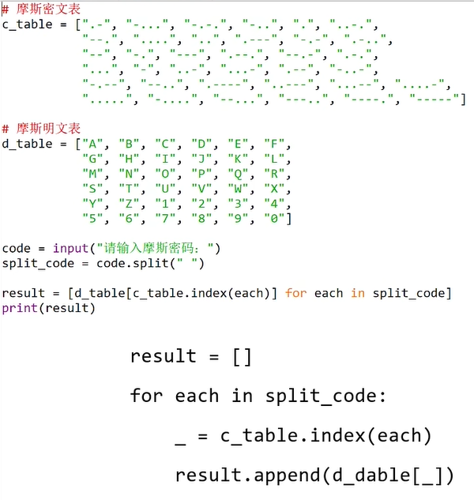
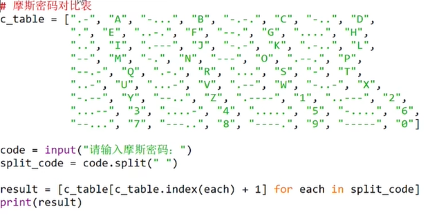
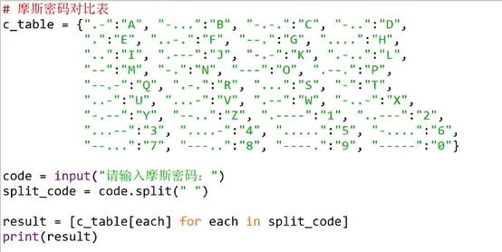

# 字典

字典是Python中唯一实现映射关系的内置类型





# 字典的实现方法



在映射类型数据的获取上，字典的效率是要远远快于列表

总结:
其实这个对比测试原则上来讲是不公平的，因为字典内部的实现逻辑就是映射类型，而列表的实现只不过是拙略的模仿，算不上英雄

键 : 值

序列是通过位置的偏移来存储数据的

字典通过键来实现写入和读取

```python
x = {"吕布", "关羽"}
type(x)
<class 'set'> # 这样创建的不是字典

y ={"吕布":"口口布","关羽":"关习习"}
type(y)
<class 'dict'>  # 这样才是字典
y["吕布"]
'口口布'
```

通过指定一个不存在字典中的键，就可以创建一个新的键值对

```python
y["刘备"] = "刘baby"
y
{'吕布': '口口布', '关羽': '关习习', '刘备': '刘baby'}
```

# 创建字典

## 直接使用大括号和冒号将映射关系套牢

```python
a = {"吕布":"口口布","关羽":"关习习","刘备": "刘baby"}
```

## dict()

参数就是键值对

注意：键值不能加引号

```python
b = dict(吕布="口口布",关羽="关习习",刘备="刘baby")
```

## 使用列表作为参数

列表中的每个元素是使用元组包裹起来的键值对

```python
c = dict([("吕布","口口布"),("关羽","关习习"),("刘备","刘baby")])
```

## 第一种方法作为参数传递给dict()

```python
d = dict({"吕布":"口口布","关羽":"关习习","刘备": "刘baby"})
```

## 混合使用

```python
e = dict({"吕布":"口口布","关羽":"关习习"},刘备="刘baby")
```

## zip()作为参数使用

```python
f = dict(zip(["吕布","关羽","刘备"],["口口布","关习习","刘baby"]))
```

这些其实都是相等的

```python
a == b == c == d == e == f
True
```

# 增

## fromkeys(iterable[, values])

可以使用iterable参数指定的可迭代对象来创建一个新的字典并将所有的值初始化为values参数指定的值

```python
d = dict.fromkeys("Fish",250)
d
{'F': 250, 'i': 250, 's': 250, 'h': 250}
```

就适用于从无到有创建一个所有键的值都相同的字典

不存在重复的键

修改某个值

```python
d['F']=70

d
{'F': 70, 'i': 250, 's': 250, 'h': 250}
```

没有的就是创建一个新的

```python
d['C']=67
d
{'F': 70, 'i': 250, 's': 250, 'h': 250, 'C': 67}
```

# 删

## pop(key[, default])

```python
d.pop('s')
250  # 返回被删除的值

d
{'F': 70, 'i': 250, 'h': 250, 'C': 67}
```

删除没有的值会抛出异常

```python
d.pop("狗") 
Traceback (most recent call last):
  File "<pyshell#178>", line 1, in <module>
    d.pop("狗")
KeyError: '狗'
```

通过设置default让异常抛出得更美观

```python
d.pop("狗", "没有")
'没有'
```

## popitem()

删除的是最后一个加入字典的键值对

```python
d.popitem()
('C', 67)

d
{'F': 70, 'i': 250, 'h': 250}
```

## del关键字

用于删除一个指定的字典元素

```python
del d['i']
d
{'F': 70, 'h': 250}
```

删除整个字典

```python
del d
d
Traceback (most recent call last):
  File "<pyshell#186>", line 1, in <module>
    d
NameError: name 'd' is not defined. Did you mean: 'id'?
```

## clear()

清空字典的内容

```python
d = dict.fromkeys("Fish",250)

d
{'F': 250, 'i': 250, 's': 250, 'h': 250}

d.clear()

d
{}
```

# 改

```python
d = dict.fromkeys("FishC")

d
{'F': None, 'i': None, 's': None, 'h': None, 'C': None}

d['s'] = 115

d
{'F': None, 'i': None, 's': 115, 'h': None, 'C': None}
```

## update([other])

支持同时给它传多个键值对或者一个包含键值对的一个可迭代对象

```python
d.update({'i':105,'h':104})
d
{'F': None, 'i': 105, 's': 115, 'h': 104, 'C': None}

d.update(F = '70',C ='67')
d
{'F': '70', 'i': 105, 's': 115, 'h': 104, 'C': '67'}
```

# 查

直接输入键就可以查

```python
d['C']
'67'

d['c']
Traceback (most recent call last):
  File "<pyshell#9>", line 1, in <module>
    d['c']
KeyError: 'c'
```

但是找不到会直接报错，被认为用户使用体验不好

最好使用下面的函数

## get(key[, default])

default：指定找不到键值时返回的值

```python
d.get('c',"这里没有c")
'这里没有c'
```

## setdefault(key[, default])

查找某一键值是否在字典中，存在返回对应的值，不存在则赋新值

```python
d.setdefault('C',"code")
'67'

d.setdefault('x',"code")
'code'

d
{'F': '70', 'i': 105, 's': 115, 'h': 104, 'C': '67', 'x': 'code'}
```

## items()

获取字典的键值对的视图对象

视图对象即字典的动态视图，这就意味着当字典的内容发生改变的时候，视图对象的内容也会相应地跟着改变

```python
items = d.items()

items
dict_items([('F', '70'), ('i', 105), ('s', 115), ('h', 104), ('C', '67'), ('x', 'code')])
```

## keys()

获取字典的键的视图对象

```python
keys = d.keys()

keys
dict_keys(['F', 'i', 's', 'h', 'C', 'x'])
```

## values()

获取字典的值的视图对象

```python
values = d.values()

values
dict_values(['70', 105, 115, 104, '67', 'code'])
```

```python
d.pop('C')
'67'

d
{'F': '70', 'i': 105, 's': 115, 'h': 104, 'x': 'code'}

items
dict_items([('F', '70'), ('i', 105), ('s', 115), ('h', 104), ('x', 'code')])

keys
dict_keys(['F', 'i', 's', 'h', 'x'])

values
dict_values(['70', 105, 115, 104, 'code'])
```

## copy()

浅拷贝

```python
e = d.copy()
e
{'F': '70', 'i': 105, 's': 115, 'h': 104, 'x': 'code'}
```

## len()

获取字典中键值对的数量

```python
len(d)
5
```

## in()

判断某个键是否存在于字典中

```python
'h' in d
True
```

## not in()

```python
'c' not in d
True
```

## list()

```python
list(d)
['F', 'i', 's', 'h', 'x']

list(d.values())
['70', 105, 115, 104, 'code']
```

## iter()

将字典的键构成迭代器

```python
e = iter(d)

next(e)
'F'
next(e)
'i'
next(e)
's'
next(e)
'h'
next(e)
'x'
```

## reversed()

3.8版本之后字典也有序列了，可以使用该函数排序

```python
list(reversed(d.values()))
['code', 104, 115, 105, '70']
```

# 嵌套

某个键的值是另外的一个字典

```python
d = {"吕布":{"语文":60,"数学":70,"英语":80},"关羽":{"语文":80,"数学":90,"英语":70}}

d
{'吕布': {'语文': 60, '数学': 70, '英语': 80}, '关羽': {'语文': 80, '数学': 90, '英语': 70}}

d["吕布"]["数学"]
70
```

还可以嵌套列表

```python
d = {"吕布":[60,70,80],"关羽":[80,90,70]}
d["吕布"][1]
70
```

# 字典推导式

```python
d = {'F':70,'i':105,'s':115,'h':104,'C':67}

# 键和值交换
b = {v:k for k,v in d.items()}
b
{70: 'F', 105: 'i', 115: 's', 104: 'h', 67: 'C'}

c = {v:k for k,v in d.items() if v >100}
c
{105: 'i', 115: 's', 104: 'h'}

# 一次求出字符串中每个字符的编码
d = {x:ord(x) for x in "FishC"}
d
{'F': 70, 'i': 105, 's': 115, 'h': 104, 'C': 67}

# 双重循环，键值重复赋值，只会保留最后赋值的那个
d = {x:y for x in [1,3,5] for y in [2,4,6]}
d
{1: 6, 3: 6, 5: 6}
```