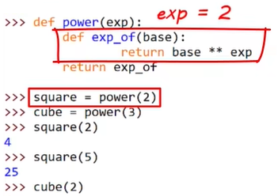
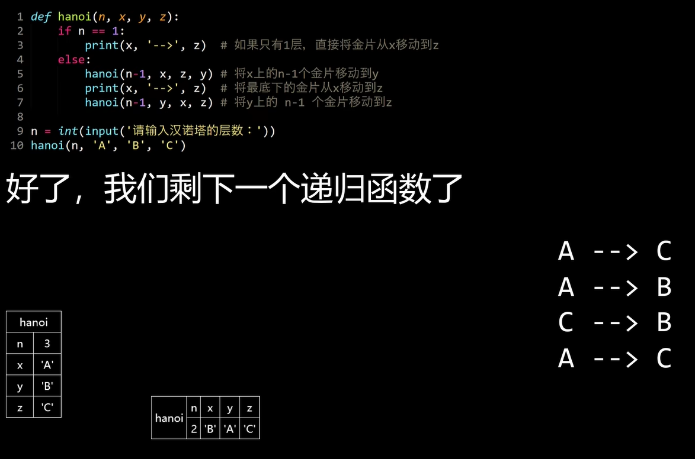
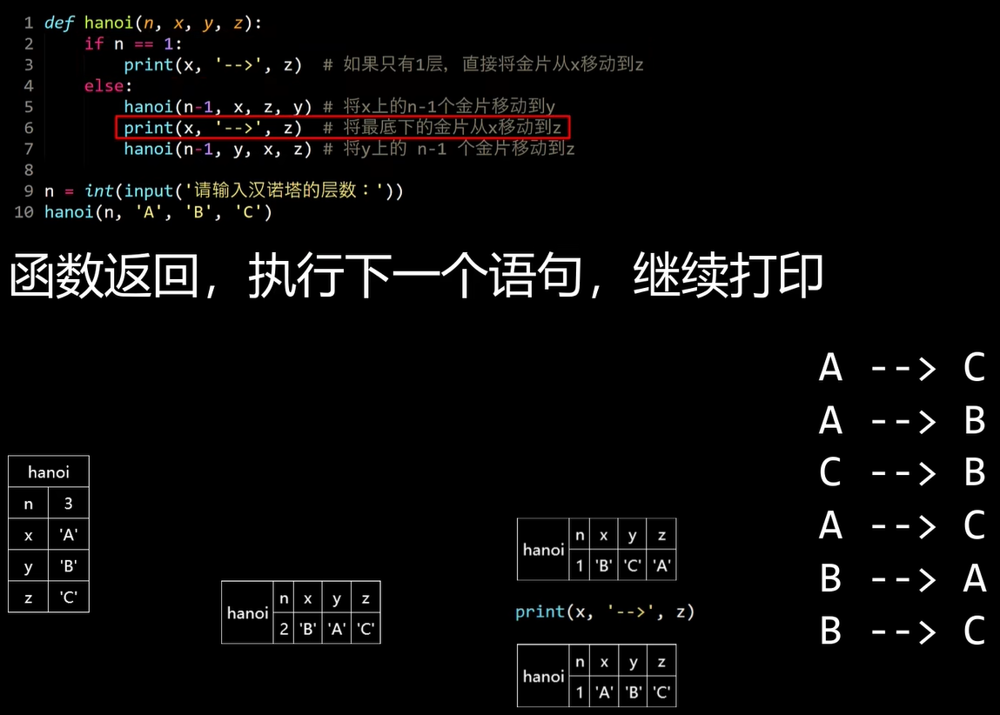
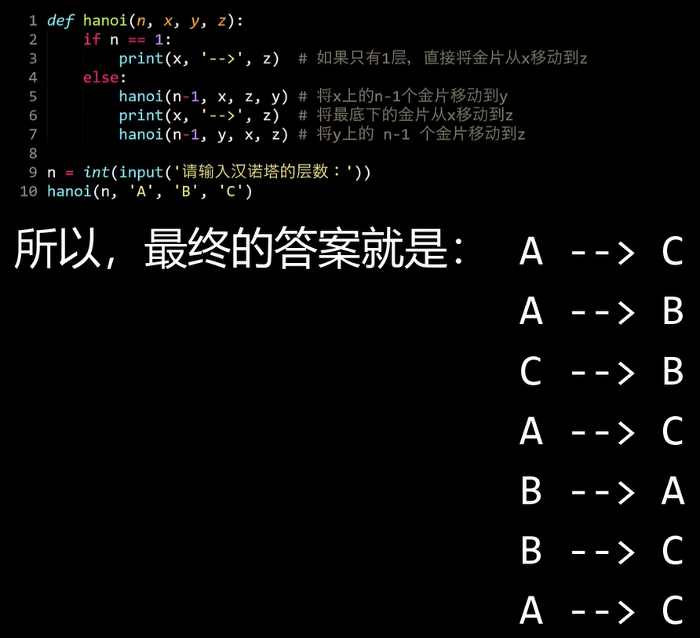

# 函数

好处：

1. 就是可以最大程度的实现代码的重用，减少冗余的代码
2. 可以将不同功能的代码进行封装、分解，从而降低结构的复杂度，提高代码的可读性

# 创建和调用函数

创建函数

```python
def myfunc():
    pass
```

pass是占位符

创建和调用

```python
def myfunc():
    for i in range(3):
        print("I love FishC")

        

myfunc()
I love FishC
I love FishC
I love FishC
```

# 函数的参数

通过函数的参数实现功能的定制，是定制的接口

```python
def myfunc(name):
    for i in range(3):
        print(f"I love {name}.")

        
myfunc("Python")
I love Python.
I love Python.
I love Python.
```

## 形式参数

函数定义时写的参数的名字

## 实际参数

调用函数时传递进去的值

可以多个参数

```python
def myfunc(name,times):
    for i in range(times):
        print(f"I love {name}.")

        
myfunc("Python", 5)
I love Python.
I love Python.
I love Python.
I love Python.
I love Python.
```

# 函数的返回值

# return

自定义的函数也可以返回

```python
def div(x,y):
    z = x/y
    return z

div(4,2)
2.0

def div(x,y):
    return x / y

div(4,2)
2.0

def div(x,y):
    if y == 0:
        return "除数不能为0！"
    else:
        return x / y
   
div(4,2)
2.0
div(4,0)
'除数不能为0！'
```

只要return，立马返回，不会理会后面的语句

```python
def div(x,y):
    if y == 0:
        return "除数不能为0！"
    return x / y

div(4,2)
2.0
div(4,0)
'除数不能为0！'
```

函数没有显式地返回内容会自己在执行完函数体中的所有语句之后返回none值

```python
def myfunc():
    pass

print(myfunc())
None
```

# 参数

## 位置参数

Python中位置固定的参数，按照位置正确传递即可

```python
def myfunc(s, vt, o):
    return "".join((o, vt, s))

myfunc("我", "打了", "小甲鱼")
'小甲鱼打了我'

myfunc("小甲鱼", "打了", "我")
'我打了小甲鱼'
```

参数位置一多就不好记

## 关键字参数

知道名字即可，不用管顺序

```python
myfunc(o = "我", vt = "打了", s = "小甲鱼")
'我打了小甲鱼'
```

同时使用这位置参数和关键字参数还是要注意顺序的

<blockquote style="background-color: #fdebec; ">位置参数必须在关键字参数之前
</blockquote> 

报错了

```python
myfunc(o = "我", "清蒸", "小甲鱼")
SyntaxError: positional argument follows keyword argument
```

改正位置之后

```python
def myfunc(s, vt, o = "小甲鱼"):
    return "".join((o, vt, s))

myfunc("香蕉", "吃")
'小甲鱼吃香蕉'

myfunc("香蕉", "吃", "不二如是")
'不二如是吃香蕉'
```

## 默认参数

Python允许函数的参数在定义的时候就指定默认值的，没有传入实参用默认值代替

<blockquote style="background-color: #fdebec; ">使用默认参数将其放在最后
</blockquote> 

```python
def myfunc(s = "苹果", vt, o = "小甲鱼"):
    return "".join((o, vt, s))
SyntaxError: parameter without a default follows parameter with a default

# -----------------------------------------------------------------------

def myfunc(vt, s = "苹果" , o = "小甲鱼"):
    return "".join((o, vt, s))

myfunc("拱了")
'小甲鱼拱了苹果'
```

使用help()查看函数时

<blockquote style="background-color: #fdebec; color:red;"> “/“<b>左侧</b>必须传递<b>位置</b>参数，不能是关键字参数，右侧随便
</blockquote> 

```python
abs(-1.5)
1.5

abs(x = -1.5)
Traceback (most recent call last):
  File "<pyshell#169>", line 1, in <module>
    abs(x = -1.5)
TypeError: abs() takes no keyword arguments

sum([1,2,3],4)
10

sum([1,2,3], start =4)
10
```

```python
def abc(a, /, b, c):
    print(a, b, c)

    
abc(1,2,3)
1 2 3

abc(a = 1,2,3)
SyntaxError: positional argument follows keyword argument

abc(3, b = 2, c = 1)
3 2 1
```

### <blockquote style="background-color: #fdebec; color:red;">“ * ”左侧随便，<b>右侧必须是关键字参数，“*”其实就是匿名的收集参数</b>
</blockquote> 

```python
def abc(a, *, b, c):
    print(a, b, c)

    
abc(1,2,3)
Traceback (most recent call last):
  File "<pyshell#181>", line 1, in <module>
    abc(1,2,3)
TypeError: abc() takes 1 positional argument but 3 were given

abc(1,b=2,c=3)
1 2 3

abc(a=1,b=2,c=3)
1 2 3
```

> 自定义参数同样遵守这样的规则
> 

## 收集参数

用户想传几个就几个，比如print()

```python
print("小甲鱼")
小甲鱼
print("小甲鱼","爱","编程")
小甲鱼 爱 编程
```

形参前面加”*”即可

```python
def myfunc(*args):
    print("有{}个参数".format(len(args)))
    print("第2个参数是：{}".format(args[1]))

    

myfunc("小甲鱼","不二如是")
有2个参数
第2个参数是：不二如是

myfunc(1,2,3,4,5)
有5个参数
第2个参数是：2
```

相当于打包的操作，多个参数打包到元组里面，其实就是元组

```python
def myfunc(*args):
    print(type(args))

    
myfunc()
<class 'tuple'>
```

元组具有打包和解包的功能

```python
def myfunc(*args):
    print(args)

    
myfunc(1,2,3,4,5)
(1, 2, 3, 4, 5)
```

返回多个值也是元组，也就是打包

```python
def myfunc():
    return 1,2,3

myfunc()
(1, 2, 3)
```

可以把返回值解包

```python
x,y,z = myfunc()

x
1

y
2

z
3
```

<blockquote style="background-color: #fdebec; ">注意：如果在收集参数后面还需要制定其他参数那么在调用函数的时候应该使用关键字参数来指定后面的参数，否则Python就会把实参纳入到收集参数中
</blockquote> 


[和上面讲的一样](#--左侧随便右侧必须是关键字参数其实就是匿名的收集参数)

```python
def myfunc(*args, a, b):
    print(args, a, b)

 
# 不这么做会直接报错  
myfunc(1,2,3,4,5)
Traceback (most recent call last):
  File "<pyshell#32>", line 1, in <module>
    myfunc(1,2,3,4,5)
TypeError: myfunc() missing 2 required keyword-only arguments: 'a' and 'b'

myfunc(1,2,3, a=4, b=5)
(1, 2, 3) 4 5
```

还可以打包为字典

使用两个连续的“*”

这种情况必须使用使用关键字参数，因为字典是键值对，一个键，一个值，等于号左边是键，右边是值

```python
def myfunc(**kwargs):
    print(kwargs)

    
myfunc(a=1, b=2, c=3)
{'a': 1, 'b': 2, 'c': 3}
```

注意：小甲鱼在字典构造那一节里留了一个悬念，使用dict构造字典时键不需要使用引号，在函数的时候会讲到

### 混合使用

```python
def myfunc(a, *b, **c):
    print(a, b, c)

    
myfunc(1,2,3,4, x=5, y=6)
1 (2, 3, 4) {'x': 5, 'y': 6}
```

format()方法就是同时拥有两种收集参数的

## 解包参数

这一个星号和两个星号不仅可以在函数定义的时候使用，在函数调用的时候呢也是有特殊效果的，在形参上使用我们称之为参数的打包，实参上的使用称之为解包

不解包时会报错

```python
args=(1,2,3,4)

def myfunc(a,b,c,d):
    print(a,b,c,d)

myfunc(args)
Traceback (most recent call last):
  File "<pyshell#47>", line 1, in <module>
    myfunc(args)
NameError: name 'args' is not defined
```

“*”：对应的是元组

```python
myfunc(*args)
1 2 3 4
```

“**”：关键字参数

```python
kwargs={'a':1,'b':2,'c':3,'d':4}

myfunc(**kwargs)
1 2 3 4
```

# 作用域

变量可以被访问的范围

变量的作用域通常由其在代码中被赋值的位置来决定的

## 局部作用域

在函数内部，只限在函数内部作用

```python
def myfunc():
    x=520
    print(x)

    
myfunc()
520

print(x)
Traceback (most recent call last):
  File "<pyshell#5>", line 1, in <module>
    print(x)
NameError: name 'x' is not defined
```

## 全局作用域

在任何函数的外部定义的变量，其作用是全局的 ，也叫全局变量

```python
x=880
def myfunc():
    print(x)

    
myfunc()
880

def myfunc():
    x=520
    print(x)

    
myfunc()
520

print(x)
880
```

函数中同名的局部变量会覆盖全局变量，但其实是不是同一个变量，只是名字相同

```python
x = 880

id(x)
1595984880080

def myfunc():
    print(id(x))
    
myfunc()
1595984880080

def myfunc():
    x=520
    print(id(x))

   
myfunc()
1595984886160
```

<blockquote style="background-color: #fdebec; ">全局变量可以在函数的内部被访问到，但是无法在函数中修改它的值，因为一旦试图对其进行赋值操作，Python会立刻创建一个同名的局部变量进行覆盖
</blockquote> 

可以看作Python的保护表现，就是给容易出现bug的操作增加困难

## global语句

在函数内部表明修改的是全局变量的值而不是覆盖

```python
x = 880

def myfunc():
    global x
    x = 520
    print(x)

    
myfunc()
520

print(x)
520
```

不提倡，会出现意想不到并且难以排查和维护的bug

## 嵌套函数

内部函数（嵌套的函数）无法被直接调用

```python
def funA():
    x = 520
    def funB():
        x = 880
        print("In funB,x =", x)
    print("In funA,x =", x)

    
funB()
Traceback (most recent call last):
  File "<pyshell#44>", line 1, in <module>
    funB()
NameError: name 'funB' is not defined. Did you mean: 'funA'?
```

只能通过外部函数去调用

```python
def funA():
    x = 520
    def funB():
        x = 880
        print("In funB,x =", x)
    funB()
    print("In funA,x =", x)

    
funA()
In funB,x = 880
In funA,x = 520
```

内部函数可以访问到外部函数的变量，但是却无法修改

## nonlocal语句

实现僭越，是的内部函数可以修改外部函数的变量

```python
def funA():
    x = 520
    def funB():
        nonlocal x
        x = 880
        print("In funB,x =", x)
    funB()
    print("In funA,x =", x)

    
funA()
In funB,x = 880
In funA,x = 880
```

## LEGB规则

作用域之间的影响范围又存在互相覆盖的情况，冲突出现的时候

Local

Enclosed   嵌套函数的外层作用域

Global

Build-In 内置作用域

```python
```python
str = "小甲鱼把str给毁了"

str(520)
Traceback (most recent call last):
  File "<pyshell#52>", line 1, in <module>
    str(520)
TypeError: 'str' object is not callable
```

当局部作用域与全局作用域发生冲突的时候，Python会使用局部作用域的变量，除非你使用Global语句进行特别的声明

然后当函数嵌套发生的时候，局部作用域又会覆盖外层函数的这个作用域，除非你使用nonlocal语句进行声明

Build-In 地位最低，比如BIF，Bulid-In Funtion只要起一个变量名和它一样的就足以摧毁这个内置函数

不要起一些和内置函数相同的变量名

# 闭包

<blockquote style="background-color: #fdebec; ">
核心技巧

1. 利用嵌套函数的外层作用域具有记忆能力这个<span style="color:red;">特性，让数据保存在外层函数的参数或者变量中<span>
2. 将内层函数作为返回值给返回，这样可以从外部间接调用到内层的函数</blockquote>


函数只有在定义和调用的时候才会用到小括号

对于嵌套函数来说，外层函数的作用域会通过某种形式给保存下来的，尽管外层函数已经调用完了，但是外层作用域里面的变量它是会保存下来的，并不会像局部作用域那样调用完就消失了

闭包又叫工厂函数

由于参数不同，得到了两个不同的生产线

```python
def power(exp):
    def exp_of(base):
        return base ** exp
    return exp_of

square = power(2)
cube = power(3)

square(2)
4

square(5)
25

cube(2)
8

cube(5)
125
```

cube变量指向的exp_of()函数记住了外层函数作用域的这个exp参数的值是2

所以调用square总是计算平方

调用cube总是计算立方




```python
def outer():
    x = 0
    y = 0
    def inner(x1, y1):
        nonlocal x, y
        x += x1
        y += y1
        print(f"现在，x = {x}, y = {y}")
    return inner

move = outer()

move(1,2)
现在，x = 1, y = 2

move(-2,2)
现在，x = -1, y = 4
```

利用内层函数能够记住外层函数的这个作用域这个特性，并且使用nonlocal让它可以修改到外层函数作用域的里面的这个变量，就可以实现一个带记忆功能的一个函数

用在游戏中很常见，闭包

我们需要将游戏中的角色移动位置给保护起来，不希望被其它函数轻易的就能够去修改到它，利用闭包来实现

```python
origin = (0, 0)      # 这个是原点
legal_x =[-10, 100]  # 限定 x 轴的移动范围
legal_y =[-100, 100] #限定 y 轴的移动范围

def create(pos_x=0, pos_y=0):
	def moving(direction, step):
		nonlocal pos_x, pos_y
		new_x = pos_x + direction[0] * step
		new_y = pos_y + direction[1] * step

	if new_x < legal_x[0]:
		pos_x = legal_x[0] - (new_x - legal_x[0])
	elif new_x > legal_x[1]:
		pos_x = legal_x[1] - (new_x - legal_x[1])
	else:
		pos_x = new_x

	if new_y < legal_y[0]:
		pos y = legal y[0] - (new_y - egal_y[0])
	elif new_y > legal y[1]:
		pos_y = legal_y[1] - ((new_y - legal_y[1])
	else:
		pos_y = new_y
	return pos_x, pos_y

return moving
```

向右：[1,0]

向上：[0,1]

向左：[-1,0]

向下：[0,-1]

```python
move = create()
print("向右移动20步后，位置是:", move([1, 0], 20))
向右移动20步后，位置是: (20, 0)

# 超过范围之后，撞墙之后返回20
print("向上移动120步后，位置是:", move([0, 1], 120))
向上移动120步后，位置是: (20, 80)

print("向右下角移动88步后，位置是:", move([1, -1]，88))
向右下角移动88步后，位置是: (92, -8)
```

# 装饰器

把函数作为参数传递给另一个函数

函数的函数名就是函数的引用，加上小括号就是函数的调用

```python
def report(func):
    print("主人，我要开始调用函数了...")
    func()
    print("主人，我调用完函数了，快夸夸我^o^")
    
report(myfunc)

主人，我要开始调用函数了...
正在调用myfunc...
主人，我调用完函数了，快夸夸我^o^
```

time模块

```python
import time
def time_master(func):
    print("开始运行程序...")
    start = time.time()
    func()
    stop = time.time()
    print("结束程序运行...")
    print(f"一共耗费了{(stop-start):.2f}秒。")

    
def myfunc():
    time.sleep(2)
    print("Hello FishC.")

    
time_master(myfunc)
开始运行程序...
Hello FishC.
结束程序运行...
一共耗费了2.04秒。
```

并不是最优的解决方案，因为每次想知道需要多长时间都要显式调用

```python

```

更好的方式是调用myfunc()shi自觉调用time_master()函数


装饰器原本的样子

```python
import time

def time_master(func):
    def call_func():
        print("开始运行程序...")
        start = time.time()
        func()
        stop = time.time()
        print("结束程序运行...")
        print(f"一共耗费了{(stop-start):.2f}秒。")
    return call_func

    
def myfunc():
    time.sleep(2)
    print("Hello FishC.")

    
myfunc = time_master(myfunc)

myfunc()
```

当我们去调用time_master()这个函数的时候，并不会执行内部的call_func，而是将它返回

```python
myfunc = time_master(myfunc)

myfunc()
```

这里调用了time_master()，并且把myfunc给传递进去，这时候不会调用，而是返回内部的call_func，把内部返回的call_func赋值给myfunc，这样调用myfunc的时候就相当于调用这个call_func

装饰器一般使用语法糖

```python
import time

def time_master(func):
    def call_func():
        print("开始运行程序...")
        start = time.time()
        func()
        stop = time.time()
        print("结束程序运行...")
        print(f"一共耗费了{(stop-start):.2f}秒。")
    return call_func

@time_master
def myfunc():
    time.sleep(2)
    print("Hello FishC.")

myfunc()
```

<blockquote style="background-color: #fdebec; ">在函数的定义前面加上一个@，再加上装饰器的名字
</blockquote> 

<blockquote style="background-color: #edf3ec; ">这么写相当于后面调用myfunc的时候并不是直接去调用mufunc，而是把myfunc这个函数作为一个参数塞到这个装饰器里面，然后去调用这个装饰器
</blockquote> 

<div style="color:red;background-color:#f1f1ef;"><b>多个装饰器可以用在同一个函数上</b></div></br>

```python
def add(func):
    def inner():
        x = func()
        return x + 1
    return inner

def cube(func):
    def inner():
        x = func()
        return x * x * x
    return inner

def square(func):
    def inner():
        x = func()
        return x * x
    return inner

@add
@cube
@square
def test():
    return 2

print(test())

65
```

调用的顺序是square→cube→add

## 给装饰器传递参数

语法糖

```python
import time
def logger(msg):
    def time_master(func):
        def call_func():
            start = time.time()
            func()
            stop = time.time()
            print(f"[{msg}]一共耗费了 {(stop-start):.2f}")
        return call_func
    return time_master

@logger(msg="A")
def funA():
    time.sleep(1)
    print("正在调用funA...")
    
@logger(msg="B")
def funB():
    time.sleep(1)
    print("正在调用funB...")

funA()
funB()

正在调用funA...
[A]一共耗费了 1.02
正在调用funB...
[B]一共耗费了 1.08
```

原本的样子

```python
import time
def logger(msg):
    def time_master(func):
        def call_func():
            start = time.time()
            func()
            stop = time.time()
            print(f"[{msg}]一共耗费了 {(stop-start):.2f}")
        return call_func
    return time_master

def funA():
    time.sleep(1)
    print("正在调用funA...")
    

def funB():
    time.sleep(1)
    print("正在调用funB...")

funA = logger(msg="A")(funA)
funB = logger(msg="B")(funB)

funA()
funB()

正在调用funA...
[A]一共耗费了 1.04
正在调用funB...
[B]一共耗费了 1.05
```

它就是通过这种嵌套的方式来实现这个参数的传递，第一次调用把参数给扔进去，第二次调用把函数扔进去


通过对比可知，只是添加一次调用，然后通过这次调用将参数给传递进去

# lambda表达式

匿名函数

一行流代码，所谓用一行代码解决复杂的问题

语法

```python
lambda arg1, arg2, arg3, ... argN : expression
```

lambda：关键字

argN：函数参数

expression ：函数实现表达式以及返回值

传统表达应该这样

```python
def <lambda>(arg1，arg2，arg3, ... argN):
	return expression
```

传统函数

```python
def squareX(x):
    return x * x

squareX(3)
9
```

lambda表达

```python
squareY = lambda y : y * y
squareY(3)
9
```

<blockquote style="background-color: #fdebec; ">其实和传统的表达式完全不同，传统定义的函数，函数名就是一个函数的引用，而lambda整个表达式就是一个函数的引用
</blockquote> 

```python
squareX
<function squareX at 0x000001F0D5F6E2A0>

squareY
<function <lambda> at 0x000001F0D5F6E3E0>
```

因为是表达式，可以用在常规函数不可能存在的地方

实际开发不建议这么写

```python
y = [lambda x :  x * x, 2, 3]
y[0](y[1])
4
y[0](y[2])
9
```

是表达式而不是语句，所以能够出现在Python语法不允许def语句出现的地方（最大优势）

但由于所有的功能代码都局限在一个表达式中去实现，通常只能实现较为简单的需求，但这也是设计者的本意

较复杂的功能和函数由def设计

一些应用

map第一个参数函数的引用，剩下的参数要求是序列类型

```python
mapped = map(lambda x : ord(x) + 10, "FishC")
list(mapped)
[80, 115, 125, 114, 77]

# --------------------------------

# 函数
def boring(x):
    return ord(x) + 10

list(map(boring,"FishC")
[80, 115, 125, 114, 77]
```

```python
list(filter(lambda x : x % 2,range(10)))
[1, 3, 5, 7, 9]
```

# 生成器

函数将控制权交还给调用者就是结束了

在函数退出之后还能保留最后的状态

闭包复杂

全局变量

过多的使用全局变量会污染命名空间

## 定义生成器

1. 在函数中使用yield表达式来代替函数中的return语句

```python
def counter():
    i = 0
    while i <= 5:
        yield i
        i += 1

        
counter()
<generator object counter at 0x000001F0D59C3E80>
```

每作用一次调用一次数据，并且记住当时的状态

```python
for i in counter():
    print(i)

    
0
1
2
3
4
5
```

counter()生成器就是每次调用的时候<span style="color:red;">**提供一个数据**</span>

深入讲解：
每次在执行到 yield i 的时候就生成一个数据暂停并保留状态
下一次调用则从下一个语句 i+=1 开始继续执行

<blockquote style="background-color: #fdebec; ">注意：
生成器它不像列表啊元祖啊这些可迭代对象，可以看成制造机，作用就是每调一次提供一个数据，并且会记住当时的状态</br>
而列表元组这些可迭代对象则是容器，里面存放的是早已经准备好的所有数据
</blockquote> 

可以看成是特殊的迭代器，因为不走回头路且支持next函数

```python
c = counter()
c
<generator object counter at 0x000001F0D59C3F40>
next(c)
0
next(c)
1
next(c)
2
next(c)
3
next(c)
4
next(c)
5
next(c)
Traceback (most recent call last):
  File "<pyshell#45>", line 1, in <module>
    next(c)
StopIteration
```

由于生成器每调用一次获取一个结果这样的特性，导致生成器对象是无法使用下标索引这种随机访问方式

```python
c = counter()

c[2]
Traceback (most recent call last):
  File "<pyshell#47>", line 1, in <module>
    c[2]
TypeError: 'generator' object is not subscriptable
```

斐波那契数列

```python
def fib():
    back1,back2 = 0, 1
    while True:
        yield back1
        back1, back2 = back2, back1 + back2

        

f = fib()
next(f)
0
next(f)
1
p
next(f)
1
next(f)
2
next(f)
3
next(f)
5
next(f)
8
next(f)
13
next(f)
21
```

不设置结束条件，就得到了一个永恒的斐波那契数列生成器

```python
for i in f:
	print(i)
```

1. 使用生成器表达式

推导形式获得生成器的方法

非要将列表推导式的方括号变成圆括号，如下，就是一个生成器了

```python
(i ** 2 for i in range(10))
<generator object <genexpr> at 0x000001F0D5F35D80>

t = (i ** 2 for i in range(10))

next(t)
0
next(t)
1
next(t)
4
next(t)
9

for i in t:
    print(i)

16
25
36
49
64
81
```

生成器表达式和列表推导式最大的不同就是

列表推导式会一下子将所有的数据生产出来并放到一个列表中

生成器就是一次返回一次结果

# 递归

递归就是函数调用自身的过程

```python
def funA():
    print("AWBDYL")

    
def funB():
    funA()

    
funB()
AWBDYL

def funC():
    print("AWBDYL")
    funC()

funC()

AWBDYL
AWBDYL
AWBDYL
AWBDYL
......
```

<blockquote style="background-color: #fdebec; ">要让递归正常工作必须要有一个结束条件，并且每次调用都会向着这个结束条件去推进
</blockquote> 

```python
def funC(i):
    if i > 0:
        print("AWBDYL")
        i -= 1
        funC(i)

        
funC(10)
AWBDYL
AWBDYL
AWBDYL
AWBDYL
AWBDYL
AWBDYL
AWBDYL
AWBDYL
AWBDYL
AWBDYL
```

## 阶乘

迭代

```python
def factIter(n):
    result = n
    for i in range(1, n):
        result *= i
    return result

factIter(5)
120

factIter(10)
3628800
```

递归

```python
def factRecur(n):
    if n == 1:
        return 1
    else:
        return n * factRecur(n - 1)

factRecur(5)
120

factRecur(10)
3628800
```

过程

```python
factRecur(5) = 5 * factRecur(4)
factRecur(4) = 4 * factRecur(3)
factRecur(3) = 3 * factRecur(2)
factRecur(2) = 2 * factRecur(1)
					factRecur(1)

factRecur(5) = 5 * factRecur(4)
factRecur(4) = 4 * factRecur(3)
factRecur(3) = 3 * factRecur(2)
factRecur(2) = 2 * factRecur(1)
							1

factRecur(5) = 5 * factRecur(4)
factRecur(4) = 4 * factRecur(3)
factRecur(3) = 3 * factRecur(2)
factRecur(2) = 2 * 1
							1

factRecur(5) = 5 * factRecur(4)
factRecur(4) = 4 * factRecur(3)
factRecur(3) = 3 * 2 * 1
factRecur(2) = 2 * 1
							1

factRecur(5) = 5 * factRecur(4)
factRecur(4) = 4 * 3 * 2 * 1
factRecur(3) = 3 * 2 * 1
factRecur(2) = 2 * 1
							1

factRecur(5) = 5 * 4 * 3 * 2 * 1
factRecur(4) = 4 * 3 * 2 * 1
factRecur(3) = 3 * 2 * 1
factRecur(2) = 2 * 1
							1
```

## 斐波那契数列

<blockquote style="background-color: #fdebec; ">递归有效率问题，耗费资源
</blockquote> 

迭代

```python
def fibIter(n):
    a = 1
    b = 1
    c = 1
    while n > 2:
        c = a + b
        a = b
        b = c
        n -= 1
    return c

fibIter(12)
144

fibIter(120)
5358359254990966640871840
瞬间出结果
```

递归

```python
def fibRecur(n):
    if n == 1 or n == 2:
        return 1
    else:
        return fibRecur(n-1) + fibRecur(n-2)

    
fibRecur(12)
144

fibRecur(120)
很久不出结果
```

## 汉诺塔

规则一：一次只能移动一枚金片
规则二：小片必须在大片的上面

三个金片

1. 将顶上的两个金片从A移到B
2. 将最底下的第三个金片从A移到C
3. 将B上的两个金片移动到C

第一个步骤只需要借助C就可以将两个金片从A移动到B

第个三步骤只需要借助A就可以将两个金片从B移到C啦

难点在于第一步和第三步

只有在数量降为1的时候才有可执行性，否则只需要以此减少一个即可

```python
def hanoi(n, x, y, z):
	if n == 1:
		print(x, '-->', z)  # 如果只有1层，直接将金片从x移动到z
	else:
		hanoi(n-1, x, z, y) # 将x上的n-1个金片移动到y
		print(x, '-->', z)  # 将最底下的金片从x移动到z
		hanoi(n-1, y, x, z) # 将y上的 n-1 个金片移动到z

n = int(input("请输入汉诺塔的层数 :'))
hanoi(n, 'A', 'B', 'C')
```











# 函数文档

## help()

```python
help(print)
Help on built-in function print in module builtins:

print(*args, sep=' ', end='\n', file=None, flush=False)
    Prints the values to a stream, or to sys.stdout by default.

    sep
      string inserted between values, default a space.
    end
      string appended after the last value, default a newline.
    file
      a file-like object (stream); defaults to the current sys.stdout.
    flush
      whether to forcibly flush the stream.
```

## 创建函数文档

使用字符串即可

使用字符串的形式来编写这个函数文档

<blockquote style="background-color: #fdebec; ">注意：函数文档一定是在函数的最顶部的，函数开头的几行字符串并不会被打印出来，因为它是作为函数的文档被保存起来的
</blockquote> 

```python
def exchange(dollar, rate=6.32):  
    """
    功能: 汇率转换，美元 -> 人民币
    参数:
    - dollar 美元数量
    - rate 汇率，默认值是 6.32 (2022-03-08)
    返回值:
    - 人民币的数量
    """  
    return dollar * rate

exchange(20)
126.4
```

可以使用help()函数查看自己编写的函数文档了

```python
help(exchange)
Help on function exchange in module __main__:

exchange(dollar, rate=6.32)
    功能: 汇率转换，美元 -> 人民币
    参数:
    - dollar 美元数量
    - rate 汇率，默认值是 6.32 (2022-03-08)
    返回值:
    - 人民币的数量
```

# 类型注释

标注函数的参数类型和返回值

```python
def times(s:str, n:int)->str:
    return s * n

times("FishC", 5)
'FishCFishCFishCFishCFishC'

times(5, 5)
25
```

只是作者的希望，但是用户胡来Python也不会阻止，注释是给人看的

给默认值

```python
def times(s:str = "FishC", n:int = 3) -> str:
    return s * n

times()
'FishCFishCFishC'
```

列表

```python
def times(s:list, n:int = 3) -> list:
    return s * n

times([1, 2, 3])
[1, 2, 3, 1, 2, 3, 1, 2, 3]
```

希望列表中的每一个数都是整数

```python
def times(s:list[int], n:int = 3) -> list:
    return s * n
```

字典

```python
def times(s:dict[str, int], n:int = 3) -> list:
    return list(s.keys()) * n

times({'A':1, 'B':2, 'C':3})
['A', 'B', 'C', 'A', 'B', 'C', 'A', 'B', 'C']
```

想让Python真正的做一下检测，使用第三方模块Mypy

# 内省

在程序运行的时候能够进行自我检测的一种机制

<blockquote style="background-color: #fdebec; ">是两个下划线
</blockquote> 

Python通过一些特殊的属性来实现内省的

想知道一个函数的名字，我们可以在程序运行的时候，通过这个name来获取

注意前后是下横线

```python
times.__name__
'times'
```

查看函数的类型注释

```python
times.__annotations__
{'s': dict[str, int], 'n': <class 'int'>, 'return': <class 'list'>}
```

查看函数文档

```python
exchange.__doc__
'\n    功能: 汇率转换，美元 -> 人民币\n    参数:\n    - dollar 美元数量\n    - rate 汇率，默认值是 6.32 (2022-03-08)\n    返回值:\n    - 人民币的数量\n    '
```

阅读友好

```python
print(exchange.__doc__)

    功能: 汇率转换，美元 -> 人民币
    参数:
    - dollar 美元数量
    - rate 汇率，默认值是 6.32 (2022-03-08)
    返回值:
    - 人民币的数量
```

# 高阶函数

函数是可以被当作变量一样传来传去，自由传递，那么当一个函数接收另一个函数作为参数的时候，这种函数就是高阶函数

高阶函数几乎可以说是函数式编程的灵魂所在

Python专门为此搞了个模块functools，里面包含了包含了非常多实用的高阶函数以及装饰器

## functools.reduce(function, iterable[, initializer])

<blockquote style="background-color: #e7f3f8; ">可迭代对象中的元素依次传递到第一个参数指定的函数中，最终返回累积的结果
</blockquote> 

内置函数和模块函数的这个地位不同就显示在引入这块

内置函数BIF直接给它个名字就可以调用

但是如果把它放在一个模块里，就需要先导入模块，再使用模块名字点函数名才能够用到它

```python
def add(x, y):
    return x + y

import functools
functools.reduce(add,[1, 2, 3, 4, 5])
15

# 相当于---------

add(add(add(add(1, 2), 3), 4), 5)
15

functools.reduce(lambda x,y:x*y, range(1,11))
3628800
```

# 偏函数

作用：将一个函数的多个参数给拆分多次进行传递

## functools.partial(func,/,*args,**keywords)

返回一个偏函数，当被调用时，其行为类似于 func 函数附带位置参数 args 和关键字参数 keywords 被调用

偏函数是对指定函数的二次包装，通常是将现有函数的分参数预先绑定从而得到一个新的函数

相比原函数，偏函数具有较少的可变参数，从而降低了函数调用的难度

偏函数被调用的时候，如果提供更多的参数，它们会被附加到 func 函数的位置参数 args 中；如果额外的关键字参数，它们会扩展并重载 func 函数的关键字参数 keywords

实现原理大致等价于:

```python
def partial(func，/，*args，**keywords):
	def newfunc(*fargs，**fkeywords):
		newkeywords={**keywords，**fkeywords}
		return func(*args，*fargs，**newkeywords)
	newfunc.func = func
	newfunc.args = args
	newfunc. keywords = keywords
	return newfunc
```

偏函数会“冻结”一部分函数参数，从而得到一个具有简化操作的新对象。例如，patial()可用来创建一个行为类似于int()函数的可调用对象，其中 base 参数默认为 2：

```python
from functools import partial
basetwo = partial(int，base=2)
basetwo.__doc__ ="将2进制数转换为正数”
basetwo('10010')
18
```

调用basetwo(‘10010’)就相当于调用int(’10010‘, base=2)

例子

```python
square = functools.partial(pow, exp=2)

square(2)
4

square(3)
9

cube = functools.partial(pow,exp=3)

cube(2)
8

cube(3)
27
```

## @warps装饰器

@wraps装饰器来装饰装饰器

[之前的装饰器](#装饰器)

进行询问之后

```python
myfunc.__name__
'call_func'
```

发现居然是call_func

想一下代码

```python
myfunc = time_master(myfunc)
myfunc()
```

装饰器的副作用

由于闭包的设计，这里调用myfunc()函数，其实是相当于调用了time_master()函数，然后传入myfunc作为它的参数，而调用time master()函数其实是在调用call_func()函数，所以我们这里使用name属性进行内省的时候发现它的真面目了

```python
import time
import functools

def time_master(func):
    @functools.wraps(func)
    def call_func():
        print("开始运行程序...")
        start = time.time()
        func()
        stop = time.time()
        print("结束程序运行...")
        print(f"一共耗费了{(stop-start):.2f}秒。")
    return call_func

@time_master
def myfunc():
    time.sleep(2)
    print("Hello FishC.")

myfunc()

myfunc.__name__
'myfunc'
```

这下mufunc的name还是myfunc